So I have been using
[Nexentastor](http://www.nexentastor.org "Nexentastor") for almost 2
years now in my home lab. It is an amazing storage solution. I have used
many others over the years (FreeNAS, OpenFiler, NASLite) and I by far
like Nexentastor the best. I also use HP Lefthand P4000 iSCSI storage
and fiber channel IBM SAN storage on a daily basis at work, but the ZFS
filesystem is amazing. I am using a 15 drive storage array configured
with about 8TB of protected usable storage. All configured in one zpool
with sever mirror groups within including a hot spare. I am using
[Supermicro AOC-USAS-L8i](http://www.supermicro.com/products/accessories/addon/AOC-USAS-L8i.cfm)
SAS controllers with SATA fan-out connectors. Each disk in each mirror
group is on a separate controller. Dual-Core AMD, 16GB of RAM, mirrored
syspool in hot swap trays that load from the rear using 2.5" SATA
drives. Two 1GB Intel NICs configured as an aggregate utilizing LACP L2
with multiple VLANs separating NFS and iSCSI traffic.

Screenshot below of zpool status..

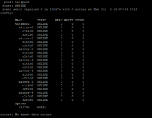

I have spent a good bit of time going through several scenarios on using
this solution with vSphere 4.x and now vSphere 5.x Using different
switches, port configurations, vswitches, and now using VDS. iSCSI
connectivity and NFS. I have pretty much settled on NFS for my bigger
VM's, but use iSCSI on some smaller vms. The reason for this is due to
the VAAI issues that exist in the current version of Nexentastor (3.1.3)
Read about it [here](http://nexentastor.org/boards/1/topics/3273)....

I wanted to put this post together for other's that may be trying to do
the same thing that I have accomplished here which will include
screenshots and settings to use on the Nexentastor NAS, Cisco 3750G
switch and also the vSphere 5.x VDS configurations all in one place so
you don't have to hunt all over Google.

_So let's get started._

First thing is to create your vlans on the 3750G.

```bash
switch01#conf t
Enter configuration commands, one per line. End with CNTL/Z.
switch01(config)#vlan 127
switch01(config-vlan)#name NFS_1
switch01(config-vlan)#exit
switch01(config)#vlan 128
switch01(config-vlan)#name NFS_2
switch01(config-vlan)#exit
switch01(config)#vlan 129
switch01(config-vlan)#name iSCSI_1
switch01(config-vlan)#exit
switch01(config)#vlan 130
switch01(config-vlan)#name iSCSI_2
switch01(config-vlan)#exit
switch01(config)#exit
switch01#sh vlan

VLAN Name Status Ports\
\-\-\-- \-\-\-\-\-\-\-\-\-\-\-\-\-\-\-\-\-\-\-\-\-\-\-\-\-\-\-\-\-\-\--
\-\-\-\-\-\-\-\--
\-\-\-\-\-\-\-\-\-\-\-\-\-\-\-\-\-\-\-\-\-\-\-\-\-\-\-\-\-\--\
127 NFS\_1 active\
128 NFS\_2 active\
129 iSCSI\_1 active\
130 iSCSI\_2 active\
switch01\#
```

configure your ports on your 3750G for LACP.

")

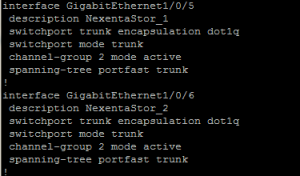

Verify that the etherchannel protocol is LACP and using L2. Bold items
below...

```bash
switch01#sh etherchannel 2 detail

**Group state = L2**\
Ports: 2 Maxports = 16\
Port-channels: 1 Max Port-channels = 16\
**Protocol: LACP**\
Ports in the group:\
\-\-\-\-\-\-\-\-\-\-\-\-\-\-\-\-\-\--\
Port: Gi1/0/5\
\-\-\-\-\-\-\-\-\-\-\--

Port state = Up Mstr Assoc In-Bndl\
Channel group = 2 Mode = Active Gcchange = -\
Port-channel = Po2 GC = - Pseudo port-channel = Po2\
Port index = 0 Load = 0x00 Protocol = LACP

Flags: S - Device is sending Slow LACPDUs F - Device is sending fast
LACPDUs.\
A - Device is in active mode. P - Device is in passive mode.

Local information:\
LACP port Admin Oper Port Port\
Port Flags State Priority Key Key Number State\
Gi1/0/5 SA bndl 32768 0x2 0x2 0x5 0x3D

Partner\'s information:\
\--More\--  \
LACP port Oper Port Port\
Port Flags Priority Dev ID Age Key Number State\
Gi1/0/5 FA 4096 001b.2198.4294 23s 0x1 0x1 0x3F

Age of the port in the current state: 02d:04h:11m:18s

Port: Gi1/0/6\
\-\-\-\-\-\-\-\-\-\-\--

Port state = Up Mstr Assoc In-Bndl\
Channel group = 2 Mode = Active Gcchange = -\
Port-channel = Po2 GC = - Pseudo port-channel = Po2\
Port index = 0 Load = 0x00 Protocol = LACP

Flags: S - Device is sending Slow LACPDUs F - Device is sending fast
LACPDUs.\
A - Device is in active mode. P - Device is in passive mode.

Local information:\
LACP port Admin Oper Port Port\
Port Flags State Priority Key Key Number State\
Gi1/0/6 SA bndl 32768 0x2 0x2 0x6 0x3D

\--More\--  Partner\'s information:

LACP port Oper Port Port\
Port Flags Priority Dev ID Age Key Number State\
Gi1/0/6 FA 4096 001b.2198.4294 23s 0x1 0x2 0x3F

Age of the port in the current state: 02d:04h:10m:47s

Port-channels in the group:\
\-\-\-\-\-\-\-\-\-\-\-\-\-\-\-\-\-\-\-\-\-\-\-\-\-\--

Port-channel: Po2 (Primary Aggregator)

\-\-\-\-\-\-\-\-\-\-\--

Age of the Port-channel = 02d:04h:59m:33s\
Logical slot/port = 10/2 Number of ports = 2\
HotStandBy port = null\
Port state = Port-channel Ag-Inuse\
**Protocol = LACP**

Ports in the Port-channel:

\--More\--  Index Load Port EC state No of bits\
\-\-\-\-\--+\-\-\-\-\--+\-\-\-\-\--+\-\-\-\-\-\-\-\-\-\-\-\-\-\-\-\-\--+\-\-\-\-\-\-\-\-\-\--\
0 00 Gi1/0/5 Active 0\
0 00 Gi1/0/6 Active 0

Time since last port bundled: 02d:04h:10m:48s Gi1/0/6

switch01\#
```

Now on your Nexentastor NAS you have to create your aggregate of ports
and enable LACP and then change from default L3,L4 (Default)
load-balancing to L2,L3.

ssh to nexentastor and login to the NMC.

```bash
nmc@nexentastor2:/$ setup network aggregation create
Links to aggregate : e1000g0, e1000g2\
LACP mode : passive\
Optional link name :\
LINK POLICY ADDRPOLICY LACPACTIVITY LACPTIMER FLAGS\
aggr1 L3,L4 auto passive short -----
```

Now you need to gain access to the real command line.

```bash
nmc@nexentastor2:/$ option expert_mode = 1

nmc@nexentastor2:/$ !bash

You are about to enter the Unix ("raw") shell and execute low-level
Unix command(s). Warning: using low-level Unix commands is not
recommended! Execute? Yes

root@nexentastor2:/volumes# dladm modify-aggr -P L2,L3 aggr1
```

Now verify that you have LACP enabled with L2,L3

```bash
root@nexentastor2:/volumes# dladm show-aggr

LINK POLICY ADDRPOLICY LACPACTIVITY LACPTIMER FLAGS\
aggr1 L2,L3 auto passive short -----\
root@nexentastor:/volumes#
```

Now configure you aggregate with additional vlans on top of your
aggregate for each of the vlans that were created on the 3750G
(127,128,129 and 130) This can be done via nmc or nmv. We will be
separating these out for current use and later use, but we can use the
different vlans for MPIO with iSCSI, and because you cannot use MPIO
with NFS we can create NFS exports on different subnets to be used as
VMware datastores mounted on different subnets which will allow us to
use different uplinks therefore creating our own MPIO functionality.

Assign an IP to each vlan as you create them.

vlan 127 - 172.16.127.50 (NFS_1)

vlan 128 - 172.16.128.50 (NFS_2)

vlan 129 - 172.16.129.50 (iSCSI_1)

vlan 130 - 172.16.130.50 (iSCSI_2)

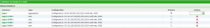

Now connect to your vCenter Server and configure your VDS (vSphere
Distributed Switch). You cannot do VDS without vCenter.

The assumption here is that you have already configured and are using
VDS in your vSphere environment. If you are not then you will need to
configure this.

Below is a view of what your VDS deployment may look like.

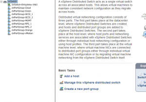

Let's configure the iSCSI ports first. There are two ways we can do the
iSCSI ports. The first way is on a single vlan for both the storage and
the vmkernel ports for each ESXi host. The second way is to use two
different vlans for the storage and the same for each ESXi host, which
is what we are going to do. This is why we created a total of four vlans
earlier in this post. Two for NFS and two for iSCSI.

Click create a new port group


Name it whatever you want and change the VLAN type to VLAN and enter 129
for the VLAN ID, click next and then finish.

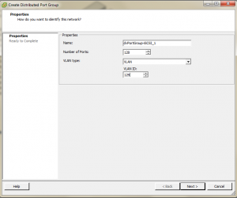

Now we need to configure the iSCSI port group that we just created.
Right click on the port group (dvPortGroup-iSCSI_1) and select edit
settings. Click on Teaming and Failover. We need to change the Active
Uplinks to only be one of your dvUplinks, and move the rest of the
Uplinks to the Unused Uplinks section. This will create the iSCSI Port
binding rule later on in the configuration of the iSCSI software storage
adapter.

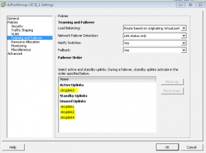

Now do the same thing as above creating the dvportgroup but change the
vlan to 130 and change the dvuplink teaming to only use dvuplink4
instead of dvuplink3.

Now we have to create the vmkernel ports to use for our iSCSI VDS Ports.

Go to the configuration tab on your host and select networking, vSphere
distributed switch and click Manage Virtual Adapters.

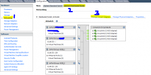

Click add, new virtual adapter, next, vmkernel

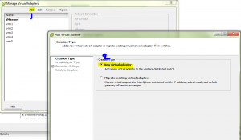

Select port group dvPortGroup-iSCSI_1, next

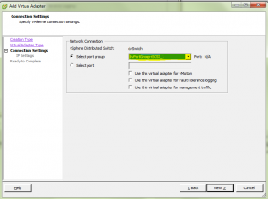

Now assign an IP address, remember we used vlan129 for iSCSI_1 and
vlan130 for iSCSI_2. Once you have assigned the IP address click next
and finish. Now you need to do the same for dvPortGroup-iSCSI_2 and use
an ip on vlan130. ex. 172.16.130.30 and follow the same process as
creating the vmkernel port for iSCSI_1. You will need to do this on
each of your hosts if you have more than one.

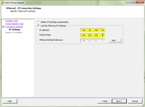

Below is a screenshot of the switch ports being graphed by cacti with
this iSCSI setup. You can see how the inbound and outbound traffic is
being spread between the two ports.

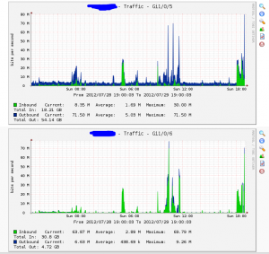

That's it for now.....Part 2 is
[here](http://everythingshouldbevirtual.com/nexentastoresxi53750glacpvdsnfsiscsi-part-2-2 "http\://everythingshouldbevirtual.com/nexentastoresxi53750glacpvdsnfsiscsi-part-2-2").
