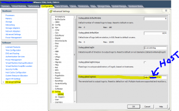

Just wanted to share this real quick for anyone who may want to setup
remote syslogging on your ESXi5 hosts. I like to configure this so I can
keep up with all of my servers in one location. This can be a splunk
server running as a syslog collector or I like to use
[loganalyzer](http://loganalyzer.adiscon.com/) running on a ubuntu
server that is also running as a cacti monitoring server. The screenshot
below shows the location of where to configure remote syslogging and
remember you need to do this for each one of your ESXi hosts.

