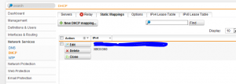
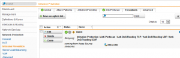
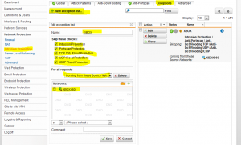

I just upgraded to the new version of Astaro yesterday. Now called
Sophos UTM 9. Love the new interface and etc. However there is an issue
with XBOX Live connecting. I restored my config from Astaro 8 which has
worked for well over a year so I know it worked until yesterday. The
issue is from the IPS (Intrusion Prevention System). If you disable IPS
XBOX Live works again. So for now because obviously you do not want to
disable IPS. I created a static mapping for the XBOX under DHCP so that
it will get the same IP address each time it starts up. You will also
want to create a network definition for your XBOX with the IP address
that it will get from DHCP so you can use it in your rules. Now go to
Network Protection, Intrusion Prevention, exceptions and create a new
exception list as the screenshot below.

DHCP Static Mapping

IPS Exception

IPS Exception Rules

Hopefully this will help someone out there. And hopefully this will be
resolved soon with a new Snort/IPS Rule.
