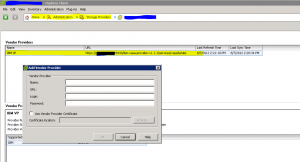
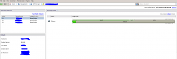

If you are using XIV Gen3 and some firmware versions of Gen2 you need to
go to this link and download and install the VASA Provider (currently
1.1.1). Read the installation guide first. The recommended approach is a
separate server from vCenter. The main reason for this is because by
default both vCenter and the VASA use TCP/8443. This also seems to be
the theme of most other storage vendors as well to put the VASA Provider
on a separate server. Of course this could be changed, but I would
follow the recommendation and keep it separate. You should also install
the IBM Storage Management Console for VMware vCenter. This will all add
an additional tab for IBM storage in vCenter. You can create LUNS, map,
and etc. using this plugin. HIGHLY RECOMMENDED!

Below is a screenshot of where you enter the VASA Storage Provider
information.

Below snapshot is of the IBM Storage Plugin for vSphere.

This link will take you to the current downloads. [IBM Support: Fix Central - Select fixes](http://www-933.ibm.com/support/fixcentral/swg/selectFixes?parent=ibm~Storage_Disk&product=ibm/Storage_Disk/XIV+Storage+System+2810,+2812&release=All&platform=All&function=all).
