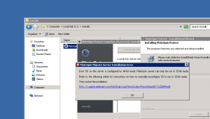
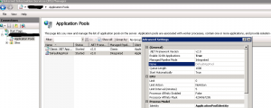
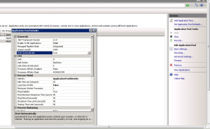
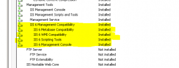

If you are using Platespin Protect for a disaster recovery solution for
your datacenter you need to know how to do this. After attempting to
upgrade to the latest 10.2 version which supports vSphere5 I have
personally lost my protected workloads during the upgrade. Thank God for
virtualizing my platespin server and of course taking a snapshot before
attempting the upgrade. I will be updating on this sometime this week as
I go through this process and document on how to do a clean upgrade.

[Support | HOWTO: How to export and import PlateSpin Migrate/Protect/Forge database](https://www.netiq.com/support/kb/doc.php?id=7970601).

Update 08/13/2012

I decided to deploy a new platespin server to run in parallel for now.
This brought on it's own challenges. Follow along. I am using Server
2008 R2.

Run the installer and install SQL Express for your local DB. You can
also use a remote SQL installation if you would like, but I chose SQL
Express. I would also recommend installing SQL Studio Express so you can
browse and manage your SQL Express installation. You need to install
MSXML6 prior to installing this and run the MSI installer from an
administrative command prompt.

First attempt at installation brought this error.

So I found the following link and followed it.

<http://www.novell.com/support/kb/doc.php?id=7920881>

Changed DefaultAppPool settings as required.

Changed Application Pool Defaults as required.

Once again got this error during install. (?>SJJ\*\*\*\*)

So after doing some more digging I finally had to enable these roles and
the installation completed.

Update....things not going so well with the upgrade. Looks like I will
have to start from scratch and remove all of my workloads from the old
server to free up licenses and then transfer my license to the new
server and start adding all of the workloads back. Have to say not too
impressed with this upgrade. All other upgrades I have done in the past
have been flawless. Not this time. The import export process is failing
with out of memory errors. The original server is server 2008 32bit with
6gb of memory. Guess what, 32bit only uses up to 4gb. So it appears that
no matter what I attempt it fails. Platespin support has been helpful,
but they could use some flexibility in situations like this. Oh well. I
will update again later on any progress.
