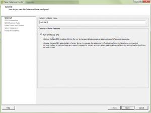
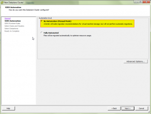
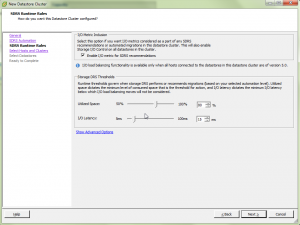
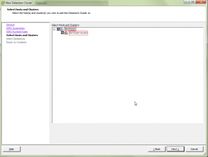
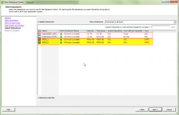
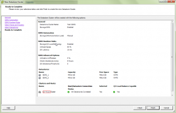
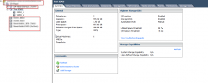
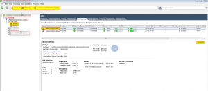
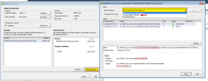
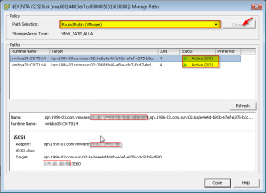

This is just a quick walk-through of setting up a new storage cluster
within vSphere5. When using a storage cluster it makes the management of
vm placement, space management and high disk IO vms easier to manage and
control automatically or manually (default). If this is your first time
using this feature I would recommend to first use the default settings
and let SDRS make recommendations that you may then take action on. This
is the same as standard DRS functionality on an HA cluster which
vmotions vms between hosts. SDRS will do storage vmotions to spread out
the load of your datastores based on IO latency (SIOC) (>15ms) and
space utilization (>80%). The downside is that as of current SRM5 does
not support Storage Clusters. Below are some screenshots which are step
by step of what it would look like setting up a new storage cluster.

Create new storage cluster and give it a name.

Select default which is manual mode. Once you get use to how it works
then you can enable fully automated.

Keep defaults. Enables SIOC (Storage IO Control), 15ms latency and 80%
storage utilization.

Select Host and clusters you want to use for the new storage cluster.

Select newly created or existing datastores to add to the storage
cluster.

View summary and click finish if everything looks good.

Summary details of the newly created storage cluster.

Make sure to enable Round Robin mutlipathing for the load balancing
policy on the new datastores if they are iSCSI, FC or FCOE connected.

