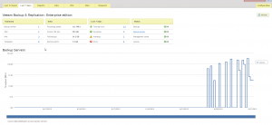

Veeam is installed and running some backups. I am not able to get the
search server portion to work however as of yet. I have installed
Microsoft Search Server 2010 Express. Seems to be working very well
right now, but seeing some high disk IO latency during backups.

Update!!

To get search server working do the following after installing search
server 2010 express.

SharePoint 2010 Central Administration → Application Management →
Service Applications: Manage service applications → Search Service
Application → Click Default content access account and change to either
your Veeam backup service account / or an account with Read access
rights to the catalog share, and NTFS permissions to the folder backing
the share
