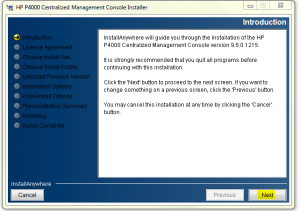

So I am getting settled after VMworld and thought I would attempt to
install the HP VSA that was being shown there. Well to say the least it
did not go well. Not sure what the issue is with the installer, but I
also attempted to run the setup as administrator (Win7 - :)  ) Below are
the snapshots from the initial install. It failed both using the command
line and gui as you can see from the screenshots below. After this
installation guide I plan on writing up some additional guides on how to
do basic configurations and some advanced configurations in the future.
I do use P4000 (HP Lefthand) SAN solutions on a day to day basis so I
will be able to provide some good stuff.

So to continue on with this I have a workaround. I will be installing
the VSA to run under VMware Workstation. You can also deploy the ovf to
ESX(i) through vCenter.

You first need to download the HP VSA. It can be downloaded from the
following link. [www.hp.com/go/tryvsa](http://www.hp.com/go/tryvsa)

After the download completes you will need to extract the zip file using
7-Zip or another unzip utility.

Browse to the following folder
"_HP_P4000_VSA_9.5_Full_Evaluation_SW_for_Vmware_ESX_requires_ESX_servers_AX696-10536\\Virtual_SAN_Appliance_Trial\\Virtual_SAN_Appliance\\vsatrial_"
and extract the files from within setup.exe.

Now within the following folder
"_HP_P4000_VSA_9.5_Full_Evaluation_SW_for_Vmware_ESX_requires_ESX_servers_AX696-10536\\Virtual_SAN_Appliance_Trial\\Virtual_SAN_Appliance\\vsatrial\\setup\\VSA_OVF_9.5.00.1215_"
double click on VSA.ovf

_YOU MUST_ be running VMware Workstation to complete this method.

This process will import into VMware workstation and you will be
presented with the following screens.

Once this completes you will have successfully imported the VSA. The
next step is to add some new virtual disks to the VSA. You can add as
many disks as you would like to, but you will need to change the Virtual
SCSI ID to start at 1:0, 1:1, 1:2 and so on. These new disks will be for
the data volume for the VSA, which we will configure here shortly.

Next thing is to install the HP CMC (Centralized Management Center).
Browse to the following folder
"_HP_P4000_VSA_9.5_Full_Evaluation_SW_for_Vmware_ESX_requires_ESX_servers_AX696-10536\\Virtual_SAN_Appliance_Trial\\Virtual_SAN_Appliance\\vsatrial\\setup\\CMC_Installer_"
and launch _CMC_9.5.00.1215_Installer.exe,_ this will install HP CMC.
Below are some screenshots of the installation.

After the CMC installation has completed we need to configure the VSA.

Edit the settings for the VSA as follows.

Now click add

Select hard disk and next...

Select create a new virtual disk and next...

Select SCSI and next...

Now enter the size of the disk you want to use and select store virtual
disk as a single file and next...

Click finish...

Now we need to change the SCSI ID of the new disk so that the VSA will
use it for virtual raid...

Highlight the new virtual disk, click advanced and in the drop down
select 1:0...

If you want to add more virtual disks make sure to change their SCSI ID
to 1:1, 1:2, etc. But for testing one virtual disk is fine.

Once you are complete with adding the virtual disks power on the VSA. It
will boot up and stop at a logon prompt.

Type start to login...

Hit enter on login screen...

Scroll down to Network TCP/IP Settings...

Hit enter...

Select eth0 and hit enter...

Enter a hostname and either select DHCP or enter a static IP. For this
walkthrough I am going to use DHCP...

\*\*Tab through fields then hit enter on ok...and enter on the next
popup...\*\*

You will now get a screen showing the IP address that was
obtained...Note this IP to add to CMC...

Now launch HP CMC if it is not already running and we are going to add
the VSA to CMC...

With CMC open select find, find systems, add...Enter the IP address
from the VSA screen above that you were given and then click ok and
close...

You should now see your new VSA listed under Available Systems...

Now double click on the VSA and expand the item and click on storage...
Verify that Raid Status is green and Normal...

If all looks good you are now ready to start using your HP P4000 VSA
(StorVirtual VSA)..

ENJOY!!!

And check back later for more information on configuration and use of
the VSA...
