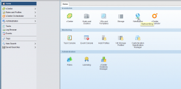
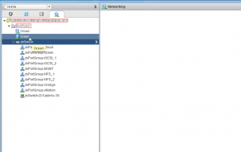
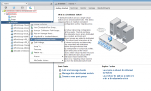
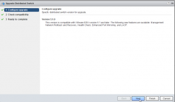
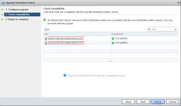
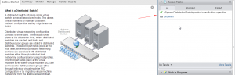

Here is a quick walk through on upgrading an existing VDS (Distributed
Switch) to version 5.1 from an older version. Upgrading to this new
version will give you the following new features. Network health check,
rollback and recovery, LACP and [more](http://www.vmware.com/files/pdf/products/vsphere/vmware-what-is-new-vsphere51.pdf "https\://www.vmware.com/files/pdf/products/vsphere/vmware-what-is-new-vsphere51.pdf").
I would highly recommend upgrading to this latest version. And as you
will see below it is very quick and easy.

Log into new web interface and get started.

Once you are logged in here is what you will see.

Click on networking

Right click on dvswitch (Your's may be named differently) and select
"Upgrade Distributed Switch"

Now just click through the next few screens and verify that it says
compatible. And Click finish. And make sure it is reports as completed
successful over on the right side pane.

And that's it. Very simple. Now go migrate your management console
ports into your VDS and have the comfort of rollback functionality if
something goes wrong in the process.
