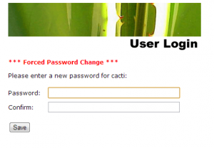
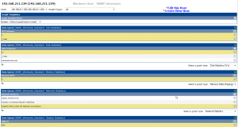

A little over four years ago I spent some time learning cacti and snmp
to come up with a good solution to monitor Windows Servers. I had used
Cacti several times previous to then, but never found any graphs that I
really liked or any that would give me the level of detail that I was
looking for. So I created my own and shared back to the Cacti community.
To this day I still use these daily at home and at work, and they
continue to work well. Today I am going to go through a quick
installation of these templates into a new cacti install and then add a
windows server 2008 to monitor.

I will be using a new Ubuntu Server 12.04 install for the cacti server.
Once the server is built install cacti using the following and follow
the screenshots.

```bash
sudo apt-get install cacti
```


Now connect to the web ui of cacti and configure

> NOTE: Change IP to reflect your cacti server

<http://192.168.211.128/cacti>


All done. Now you will be redirected back to the login screen.


Login using admin/admin and then change password on next screen




Cacti is now installed.

Download the latest version of cacti from
[here](https://everythingshouldbevirtual.com/cacti-templates-for-windows/ "http\://everythingshouldbevirtual.com/cacti-templates-for-windows/").
Version 13 is the latest at the time of writing this. Download it and
extract the zip file. There is a readme.txt that explains where to place
the files.

\*\*\*UPDATE\*\*\*

All new templates will be updated and current from GitHub.

<https://github.com/mrlesmithjr/cacti.git>

```bash
git clone https://github.com/mrlesmithjr/cacti/
```

Copy files from the resource\\snmp_queries\\ folder extracted to the
cacti server using WinSCP to the /tmp folder.


Now on the cacti server cd /tmp


```bash
sudo cp snmp_informant_standard_*.xml /usr/share/cacti/site/resource/snmp_queries/
```


All done.

Now we have to import the xml template files from the \\template folder
into the cacti web ui.


In the cacti web ui go to Import/Export/Import Templates


Now browse to the folder where you extracted the zip file to and select
the first
cacti_host_template_windows_host\_-\_snmp_informant.xml and click
import.


The templates are ready to be used now.

Now install SNMP informant Standard on your Windows machine you want to
monitor. Get SNMP Informant from [here](http://www.snmp-informant.com/downloads.htm#SNMP_Informant_-_Freeware_Products "http\://www.snmp-informant.com/downloads.htm#SNMP_Informant\_-\_Freeware_Products").
Download the 1.6 version. You need to have the Windows SNMP agent enabled and
configured on your windows machine.


Now configure the SNMP Service


We are now ready to add our first Windows Server.

Under devices/add


Now select create graphs for this host and select the statistics you
want to gather



Click create and do not change anything on the next screen. Select
create again.


There are additional drop downs for Disk, memory and network stats. Make
sure to go through select those as well.

Now you have to add the new device to the graph tree.


That's it. Now just wait for a few minutes and you should start getting
some nice looking graphs for your device.

Enjoy...

You can follow the thread over on the Cacti forum [here](http://forums.cacti.net/viewtopic.php?f=12&t=29832 "http\://forums.cacti.net/viewtopic.php?f=12&t=29832").

You can download previous versions of the templates from [here](https://everythingshouldbevirtual.com/cacti-templates-for-windows "http\://everythingshouldbevirtual.com/cacti-templates-for-windows")if
you are getting XML parse errors importing.
