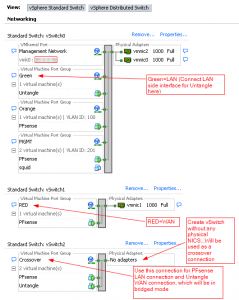

I have been using Astaro/Sophos for the past 2 years and really like it.
But I have gotten to the point where the 50 IP license restriction is
getting in my way. Yes I know this is for my home and home lab, but go
figure. So I went back to giving PFsense a shot. I used this before I
started using Astaro/Sophos as well as many other Linux Firewall distros
including building my own. But I still ran into the same issues as I had
before which is around web filtering and being a true UTM solution. I
remembered reading years ago about some who were coming up with the
Super Router which uses PFsense for firewall/routing and Untangle for
web filtering, AV scanning, Malware, ADBlocking, and etc. So I thought I
would give it a go. So I wanted to do all of this virtual of course
which I finally got sorted out and it works great. But I wanted to share
here how to set this up using ESXi to make it work correctly, and help
others who may want to do this too. It is fairly straight forward with
one catch, and that is getting bridged mode working on Untangle
correctly.

Build your PFsense firewall with the number of NICS that you require for
your network. I used 4 in my scenario so I could test WAN, LAN, DMZ and
a management subnet. Once you have PFsense working and you are able to
connect to the internet you can then proceed to building your Untangle
server. In a physical world the way this is cabled you would have a
crossover cable connected between the LAN interface of PFsense to the
WAN interface of the Untangle server and then your second interface on
the Untangle server connected to your LAN. This allows you to configure
Untangle for bridged mode therefore all of your LAN traffic passes
automatically through Untangle then to your PFsense server. So if your
LAN interface of PFsense is 192.168.1.1 and all of your LAN clients use
192.168.1.1 for their default gateway this will remain the same even
after we implement Untangle. You would then install Untangle and when
you get to the point of configuring the network settings for Untangle
you will configure the WAN port with 192.168.1.2 and then select Bridged
mode therefore there is not a need to configure an IP for your internal
Interface because both interfaces will communicate as 192.168.1.2. When
you do this in ESXi you will need to create a new vSwitch without any
physical nics connected and connect your LAN interface for PFsense and
your WAN interface for Untangle to this vSwitch. I called this vSwitch
network "crossover" for obvious reasons. You will still connect your
second interface (LAN side) of Untangle to whichever vSwitch that you
have configure for normal LAN communications. Also note that once you
enable bridged mode on the Untangle server it will disable DHCP and all
routing functionality.

So far this setup is definitely working really well. Biggest issue I
have had so far is tweaking the Snort rules I am using in PFsense for
WAN side IDS. To be expected though.

Anyways that is pretty much it for this guide. But I am including a
screenshot of what the vSphere Standard Switch setup might look like,
which include the "Crossover" network inside of the vSwitch without
any physical NICS.

\[
