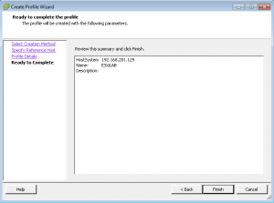

In this guide we will be installing, configuring and using the
AutoDeploy feature of vSphere 5.1. This is a great feature to use when
you need to deploy many hosts and do not want to configure a local disk
to actually load ESXi on.

So let's get started...

Install vCenter Server 5.1 (Reference for doing this install is [here](http://everythingshouldbevirtual.com/vcenter-5-1-quick-installation-screenshots "http\://everythingshouldbevirtual.com/2012/09/12/vcenter-5-1-quick-installation-screenshots/").)

Download and install PowerCLI 5.1 from [here](http://communities.vmware.com/community/vmtn/server/vsphere/automationtools/powercli?view=overview "http\://communities.vmware.com/community/vmtn/server/vsphere/automationtools/powercli?view=overview").

After the install completes launch the PowerCLI shortcut created on the
desktop (If you are using Windows 7 you will need to right click on the
shortcut and select run as administrator) and enter the following to get
rid of the error on the first launch so you will be able to use the
cmdlets. "Set-ExecutionPolicy RemoteSigned"

Now install AutoDeploy from vCenter Server 5.1 ISO or other media that
you are using.

Here are some screeshots of the installation process.

Install vSphere ESXi Dump Collector. This will be used for our
autodeploy hosts to send core dumps to. This will be configured within
our host profile to point back to. If it is not working you will get an
alert on the summary tab of your host inside viclient.

Here are some screenshots of the installation.

You will now have a new icon in your viClient on the home page. It is
called VMware ESXi Dump Collector.

We will need to configure our hosts to use this service once we have a
host profile created. The method I used is further down in this guide.
More info can be found [here](http://kb.vmware.com/selfservice/microsites/search.do?cmd=displayKC&docType=kc&docTypeID=DT_KB_1_1&externalId=2002955 "http\://kb.vmware.com/selfservice/microsites/search.do?cmd=displayKC&docType=kc&docTypeID=DT_KB_1_1&externalId=2002955").

Install VMware vSphere Syslog Collector. This will be used for our hosts
to send their logs to.

Use vCenter Integrated. This will add a new icon in VIclient home called
Network Syslog Collector. We will be using this service to send our
syslog data from our hosts.

Here are some screenshots of the installation.

Install the TFTP Server. I am using the one from [here](http://www.solarwinds.com/products/freetools/free_tftp_server.aspx "http\://www.solarwinds.com/products/freetools/free_tftp_server.aspx").
This is the free TFTP Server from Solarwinds.

Now launch VIclient and click home and click Auto Deploy

You will now need to open IE and add \*://127.0.0.1 to the trusted sites
zone to allow us to download the boot zip.

Now click Download TFTP Boot Zip and save it into c:\\TFTP-Root. This
folder was created by installing the TFTP Server from above. Now extract
the contents of the file in the root of this folder.

Now we need to configure the DHCP options for TFTP Boot to work. I am
using MS DHCP on the Domain Controller in this lab so we will be
configuring that. The options we will be configuring at #66 and #67.
For Option #66 enter the IP address of your vCenter Server that is
running the TFTP Server and for option #67 enter the following
"undionly.kpxe.vmw-hardwired", without quotes. This information is
located on your AutoDeploy screen from within the VIclient.

Download **VMware-ESXi-5.1.0-799733-depot.zip** from VMware's website.

Create a folder c:\\Depot and move the file downloaded above to here.

Now launch PowerCLI and enter _connect-viserver_ .

Now we are going to add the depot package from above.

Run this command in the PowerCLI window _Add-EsxSoftwareDepot
c:\\Depot\\VMware-ESXi-5.1.0-799733-depot.zip_

Now run _Get-EsxImageProfile_ to list the image profiles. (Still within
PowerCLI)

We will use the standard Profile which includes vmware tools in the
image.

Now run the following command _New-DeployRule --Name "FirstTimeBoot"
\--Item "ESXi-5.1.0-799733-standard" --Pattern "model=VMware Virtual
Platform"_

This is going to create an image pattern to recognize Hosts that run in
VMware Workstation, which is what my lab is using.

Once this process completes run the following command _Add-DeployRule
\-DeployRule FirstTimeBoot_ (We will use this initial deploy rule to
create our host profile)

You are now ready to boot your ESXi Hosts via TFTP.

Here is what the hosts look like when booting from AutoDeploy.

Once the hosts boot up they will automatically be added to vCenter. But
we now need to create host profiles now to get applied to the new hosts.

Configure your first host with all networking, storage, ntp, syslog
server, dns and etc. before creating the host profile. These will be the
settings that you want to be consistent across your hosts in the
cluster.

From the home screen in vCenter go to Host Profiles.

Click Create Profile and Select Create Profile from existing host.

Now select the host you want to create the profile from.

Enter the name for the profile. We are using "ESXiLAB" in this guide.

We also need to configure the host profile to send their core dumps to
the dump collector.

To configure using Host Profiles:

1.  Connect to vCenter Server using the vSphere Client.
2.  Click Home and select Host Profiles.
3.  Create or edit a host profile.
4.  Select Networking Configuration.
5.  Select Network Coredump Settings.
6.  Specify the VMkernel network interface to use for outbound traffic,
    such as `vmk0`.
7.  Specify the IP address and UDP port number of the remote network
    coredump server.
8.  Save and apply the host profile.

Within vCenter create your datacenter and create the HA cluster and give
it a name. We will be using "HA-DRS" for the cluster name.

Attach host profile "ESXiLAB" profile to the "HA-DRS" cluster. Right
click on the cluster, host profile and attach.

Now go back to the Host Profile screen (Home, Host Profiles)

Select the "ESXiLAB" profile and click Attach Host/Cluster

Now select the "HA-DRS" cluster and click attach.

Click OK and we are done with the Host Profile.

Now we are going to create an ESX software depot for our image. Read [here](http://pubs.vmware.com/vsphere-50/index.jsp?topic=%2Fcom.vmware.powercli.cmdletref.doc_50%2FAdd-EsxSoftwareDepot.html "http\://pubs.vmware.com/vsphere-50/index.jsp?topic=%2Fcom.vmware.powercli.cmdletref.doc_50%2FAdd-EsxSoftwareDepot.html") for more info on this. We will also be adding the host profile
to get applied to the hosts as they are added to the cluster.

_Add-EsxSoftwareDepot <http://192.168.201.5:80/vSphere-HA-depot>_

_New-EsxImageProfile -CloneProfile ESXi-5.1.0-799733-standard
\-name "ESXiHA"_

_Add-EsxSoftwarePackage -ImageProfile "ESXiHA" -SoftwarePackage
vmware-fdm_ (This is going to attach the host profile that we created
called "ESXiHA".

Now we need to remove the first rule that we created to begin creating
the host template.

Run this command within PowerCLI _Remove-DeployRule -DeployRule
FirstTimeBoot -delete_

_New-DeployRule --Name "GoldBootRule" --Item "ESXiHA", ESXiLAB, HA-DRS
\--Pattern "model=VMware Virtual Platform"_\
_Add-DeployRule -DeployRule "GoldBootRule"_

We are now ready to boot our ESXi hosts again and they will boot via
AutoDeploy, get added to the "HA-DRS" cluster and have the "ESXiLAB"
host profile applied to them.
