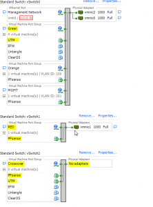
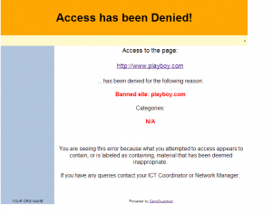
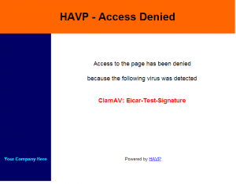

I wrote [this](http://everythingshouldbevirtual.com/super-router-pfsense-untangle/ "http\://everythingshouldbevirtual.com/super-router-pfsense-untangle/")
guide a few days ago and this solution worked great. But what if you
want to have more control of your threat management and build your own.
So that is what we are going to do here. We are going to build an inline
filtering solution using Ubuntu using ESXi.

\*\*Note I am using PFSense as my firewall. So it is configured with the
first NIC connected to the WAN (RED), and the second NIC is connected to
the "Crossover" network and configured with IP 192.168.1.1. (Reference
Picture below)\*\*\*



So here we go.

Build a fresh new Ubuntu 12.04 LTS server.

Configure your first NIC to connect to your vSwitch without any physical
NICS. In my setup this network is called "Crossover". (Reference
picture above)

Configure your second NIC to connect to your vSwitch that is used for
your LAN network. In my setup this network is called "Green".
(Reference picture above)

Make your /etc/network/interfaces look like this

```bash
sudo nano /etc/network/interfaces

auto lo
iface lo inet loopback
#bridge network
iface eth0 inet manual
iface eth1 inet manual

auto br0
iface br0 inet static
address 192.168.1.2
netmask 255.255.255.0
gateway 192.168.1.1
dns-nameservers 192.168.1.1
bridge_ports eth0 eth1
```

Had to add these lines too. Was getting a consistent timeout pinging
firewall every couple of seconds.

```bash
bridge_fd 0
bridge_stp off #This is the default but added it as a placeholder
bridge_maxage 0
bridge_ageing 0
bridge_maxwait 0

#IPTables rules
pre-up iptables-restore < /etc/iptables.rules post-down iptables-save > /etc/iptables.rules

#EBTables rules
pre-up ebtables -t broute -A BROUTING -p IPv4 --ip-protocol 6 --ip-destination-port 80 -j redirect --redirect-target ACCEPT
```

Now run this command

```bash
sudo iptables -t nat -A PREROUTING -i br0 -p tcp --dport 80 -j REDIRECT --to-port 8080
```

Run this command to save the IPTables rules.

```bash
sudo iptables-save > /etc/iptables.rules
```

Now edit /etc/sysctl.conf

```bash
sudo nano /etc/sysctl.conf
```

and uncomment the following

```bash
net.ipv4.ip_forward=1
net.ipv6.conf.all.forwarding=1
```

Now reboot your server and you should be able to communicate out to the
internet now.

Open a command prompt and ping your firewall and the server we are
building here. You should see request timed out while the UTM server is
rebooting for both the firewall and UTM. Then you will start getting a
response from the UTM and then the firewall as it builds the bridge. You
will see a few drops after the intial ping reply and then all should be
good.

Now run

```bash
sudo apt-get update && sudo apt-get upgrade
```

Once that finishes run

```bash
sudo apt-get install squid3 ebtables bridge-utils dansguardian havp clamav clamav-freshclam
```

Now we need to make squid, dansguardian and havp all work together.

```bash
sudo nano /etc/dansguardian/dansguardian.conf
```

and make the following changes

comment out the line that says UNCONFIGURED by placing a # in front of
the line.

```bash
# the port that DansGuardian listens to.
filterport = 8080

# the ip of the proxy (default is the loopback - i.e. this server)
proxyip = 127.0.0.1

# the port DansGuardian connects to proxy on
proxyport = 8090
```

Now run

```bash
sudo nano /etc/squid3/squid.conf
```

change

```bash
acl localnet src 192.168.1.0/24
```

(or whatever subnet your LAN is)

and change

```bash
http_port 3128
```

to

```bash
http_port 3128 transparent
```

Now run

```bash
sudo nano /etc/havp/havp.config
```

and add the following

```bash
PARENTPROXY 127.0.0.1
PARENTPORT 3128
PORT 8090
ENABLECLAMLIB true
CLAMDBDIR /var/lib/clamav
```

Now reboot your new Ubuntu UTM and you should now be utilizing the UTM
for normal http usage. Try to go to playboy.com or some other adult
website and you should see the following.



Go to [this](http://www.eicar.org/download/eicar.com.txt "http\://www.eicar.org/download/eicar.com.txt")
link and you should see the following.



Once that is verified that it is working. You are good to go. There are
many other tweaks and such that you can do with Dansguardian, but I am
not going into that here in this guide. But I would recommend looking up
how to use the blacklists from [Shallalist](http://www.shallalist.de/ "http\://www.shallalist.de/").

Enjoy!

\*\*\*\*UPDATE\*\*\*\* Thanks to Apple and their bullshit you will need
to add the following to your squid.conf file to get iTunes working.
iTunes apparently has a major issue working through a proxy correctly.

Because we are only redirecting normal http traffic this regexp is the
only one required. So add both lines to /etc/squid3/squid.conf and
restart squid.

```bash
acl Apple url_regex ^https?://([A-Za-z0-9.-]*\.)?apple\.com/

cache deny Apple
```

While you are in squid.conf you might want to go ahead and add the
following as well.

```bash
acl Adobe url_regex ^https?://([A-Za-z0-9.-]*\.)?adobe\.com/
acl Windows_Update url_regex ^https?://([A-Za-z0-9.-]*\.)?windowsupdate\.com/
acl Microsoft url_regex ^https?://([A-Za-z0-9.-]*\.)?microsoft\.com/
acl YouTube url_regex ^http://[A-Za-z0-9.]+\.youtube\.com/videoplayback
acl GoogleVideo url_regex ^http://[A-Za-z0-9.]+\.googlevideo\.com/videoplayback
acl OVI url_regex ^https?://[A-Za-z0-9.-]*\.ovi\.com

cache deny Apple
cache deny Adobe
cache deny Windows_Update
cache deny Microsoft
cache deny YouTube
cache deny GoogleVideo
cache deny OVI
```

\*\*Update\*\*

If you want to monitor your squid logs and get the real IP of the client
request do the following. I am using Sarg to squid reporting.

```bash
sudo nano /etc/dansguardian/dansguardian.conf
```

change line

```bash
forwardedfor = on
```

(make sure it is on)

```bash
sudo nano /etc/squid3/squid.conf
```

change line

```bash
forwarded_for on
```

(make sure it is set to on)

```bash
sudo nano /etc/havp/havp.config
```

change line

```bash
FORWARDED_IP true
```

(default is false)

change line

```bash
X_FORWARDED_FOR true
```

(default is false)

```bash
sudo /etc/init.d/squid3 restart && /etc/init.d/dansguardian restart && /etc/init.d/havp stop && /etc/init.d/havp start
```

Now your squid logs will show the correct client IP addresses instead of 127.0.0.1

Remember the flow is Dansguardian, HAVP and then Squid

Part 2 is [here](http://everythingshouldbevirtual.com/ubuntu-utm-homebrew-network-graphing "http\://everythingshouldbevirtual.com/ubuntu-utm-homebrew-network-graphing")

Part 3 is [here](http://everythingshouldbevirtual.com/ubuntu-utm-homebrew-part-3-mail-proxy-and-spam-checker "http\://everythingshouldbevirtual.com/ubuntu-utm-homebrew-part-3-mail-proxy-and-spam-checker")
