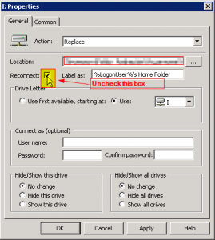

So I went ahead and loaded Windows 8 Pro this past weekend. I used it a
few times during the preview releases and didn't care much for it at
the time. Well I am starting to like it now. :) I am dual booting
Windows 7 and Windows 8 right now just in case I need to go back. So
anyways one of the first things I noticed after joining it to the domain
was that my mapped drives were no longer there. So I started poking
around and apparently there is a known issue with this. My mapped drives
on Windows 7 are working fine so I figured it had to be something with
Windows 8. Well the issue is a simple fix for now until a permanent
solution is provided by Microsoft.

How to fix it? Simple.

Edit your GPO that is setting the mapped drives and uncheck the
reconnect box and save. What? Kidding right? Nope. Let the settings
replicate, run gpupdate from an elevated cmd prompt, log out and then
log back in and there they are. All mapped drives are now back.
Apparently the issue has something to do with UAC on Windows 8.

Enjoy!
