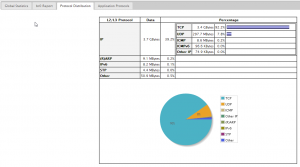
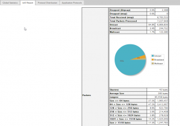
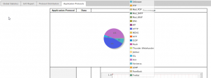

In [this](http://everythingshouldbevirtual.com/ubuntu-utm-homebrew "http\://everythingshouldbevirtual.com/ubuntu-utm-homebrew") previous post we
setup the initial UTM (Unified Threat Management). In this quick guide we will
be setting up network traffic graphing. We want to be able to see the types and
amount of traffic flowing through our UTM in nice graphs. So we will be setting up
[NTOP](http://www.ntop.org/ "http\://www.ntop.org/") to do this. We will
be building from the source code because the NTOP version that installs
from apt-get in Ubuntu 12.04 runs for a short period of time and then
crashes.

```bash
sudo apt-get build-dep ntop
sudo apt-get install graphviz
cd /tmp
wget http://sourceforge.net/projects/ntop/files/ntop/Stable/ntop-5.0.1.tar.gz
tar zxvf ntop-5.0.1.tar.gz
cd ntop-5.0.1/
sudo ./autogen.sh
sudo make
sudo make install
sudo ldconfig
sudo useradd ntop
sudo chown -R ntop.ntop /usr/local/etc/ntop
sudo chown -R ntop.ntop /usr/local/share/ntop
sudo nano /usr/local/bin/start_ntop.sh
sudo ntop -i "br0" -d -L -u ntop --skip-version-check --use-syslog=daemon --set-admin-password={your_admin_password}
sudo chmod +x /usr/local/bin/start_ntop.sh
sudo nano /etc/rc.local
```

\*\*Add the following line at the bottom before the line exit 0\*\*

```bash
/usr/local/bin/start_ntop.sh &
```

Reboot your UTM or simply run

```bash
sudo /etc/init.d/rc.local start
```

Now you will have some nice graphs and be able to see the type and
volume of traffic on your network.






