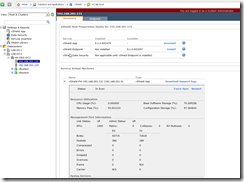
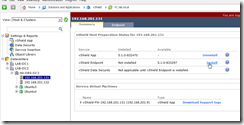
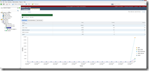

In this guide we will be installing the vShield Manager appliance and
the installing vShield App and vShield Endpoint (Now called vShield
Networking and Security). You can reference the VMware quick start guide
[here](http://www.vmware.com/pdf/vshield_51_quickstart.pdf).

The first step in this is to install the vShield Manager appliance. The
vShield Manager is the core centralized network management component of
vShield. The vShield manager can be installed on a different host than
your vShield agents. This is a good candidate to run in a separate
management vSphere cluster, but not required. There is one vShield
Manager required per vCenter instance.

Taken from the quick start guide here are the hardware requirements for
the vShield components.

-   **_Memory_**
    -   **_vShield Manager: 8GB allocated, 3GB reserved_**
    -   **_vShield App: 1GB allocated, 1 GB reserved_**
    -   **_vShield Edge compact: 256 MB, large: 1 GB, x-large: 8 GB_**
    -   **_vShield Data Security: 512 MB_**
-   **_Disk Space_**
    -   **_vShield Manager: 60 GB_**
    -   **_vShield App: 5 GB per vShield App per ESX host_**
    -   **_vShield Edge compact and large: 320 MB, lx-Large: 4.4 GB
        (with 4 GB swap file)_**
    -   **_vShield Data Security: 6GB per ESX host_**
-   **_vCPU_**
    -   **_vShield Manager: 2_**
    -   **_vShield App: 2_**
    -   **_vShield Edge compact: 1, large and x-Large: 2_**
    -   **_vShield Data Security: 1_**

So let's deploy the appliance now.

Open the vSphere client and select file, Deploy OVF Template... And
follow the screenshots.

Now the appliance will be deployed.

Once the appliance has been successfully deployed go ahead and power it
on. And we will now configure the appliance to begin using it.

Once the appliance has booted up you will need to login at the console.

The default username is **_admin_** and the default password is
**_default_**.

Now at the command prompt type **_enable_** and enter the password from
above again.

Now at the manager prompt type **_setup_**.

Now you will need to enter the following information

-   **_IP Address_**
-   **_Subnet Mask_**
-   **_Default gateway_**
-   **_Primary DNS IP_**
-   **_Secondary DNS IP_**
-   **_DNS domain search list_**

And then save the new configuration and reboot the appliance.

After the appliance reboots open your web browser up and connect to
<https://appliance_ip>

Login with **_admin_** and password is **_default_**.

Click on settings and reports.

The first thing we will configure is the Lookup Service

Click edit and enter the following information

**_Lookup Service Host (Whatever server is configured as your SSO server
for vCenter Server 5.1)_**

**_Port (Leave default)_**

**_SSO Administrator Username
(_**[_admin@System-Domain_](mailto:admin@System-Domain)**_) (This is the
default unless you changed it during the SSO installation)_**

**_Password (Use the password that you configured during the SSO
installation when installing vCenter Server 5.1)_**

\*\*\*NOTE\*\*\* If you are using the vCenter Server Appliance you will
need to check
[this](http://www.virtuallyghetto.com/2012/09/default-password-for-vcenter-sso-admin.html "http\://www.virtuallyghetto.com/2012/09/default-password-for-vcenter-sso-admin.html")
link out for the password of admin@System-Domain. William Lam's post saved
me on this.

Click OK and then choose "**_Yes_**" to accept the certificate

Here is what the Lookup Service will look like when complete

Now we will configure the vCenter Server section

Click edit and enter the following information

**_vCenter Server (IP or hostname of your vCenter Server)_**

**_Administrator Username_**

**_Administrator Password_**

Click OK and then choose "**_Yes_**" to accept the certificate

Check Install this certificate and then click ignore

Here is what the vCenter Server section will look like when completed

Now we will configure the NTP Server section

Enter IP or hostname of NTP server and click OK

Now we have completed the initial setup and your settings and reports
will look like below which will show your clusters, hosts and vms.

Now open up Internet Explorer and add \*:\\\\vshield_IP to your trusted
security zone. If you do not do this you will not be able to open up the
vShield pages within vCenter.

Now within vCenter Home screen you will see vShield listed at the bottom

Click vShield and you will see the same login window as you did when
using your browser

Username **_admin_** and the password is **_default_**

Once logged in you will see the same interface as you did when using
your browser

Select datacenters

Select your first host in the correct datacenter cluster that you want
to install vShield App on and select install vShield App. When you
install vShield app it will deploy a vm instance to the host that will
control all vms networking that are part of vShield. You cannot shut
down these vms unless the host is in maintenance mode. This is for
obvious reasons.

Now select the datastore to use for the vShield App appliance, the
management port group to use for the appliance, enter the IP address,
Netmask and Default Gateway to use.

Click Install

The installation is complete

Now install vShield Endpoint

Now follow the same process for vShield App and vShield Endpoint on each
host in your cluster.

That is all for the initial setup. Now you can click through some of the
sections within vShield and see additional areas that will need to be
setup when you are ready to start creating firewall rules and etc. But
for this is it for this guide. I will be creating another guide for
further configurations and use very soon. Which will include configuring
the vShield Edge devices. These are external connections within the
datacenter.

Below are some additional screenshots of information contained within
vShield. You should also start seeing some traffic details starting to
populate.

