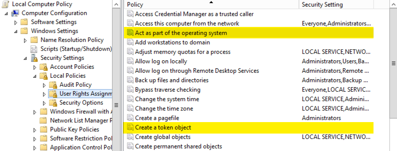

I use [backuppc](http://backuppc.sourceforge.net/ "http://backuppc.sourceforge.net/")
for backups at home which utilizes ssh and rsync to do the backups. This
works very good for a mixed OS environment and keeps it simple and
includes dedupe :). However after installing and running Windows 8 I
have not been able to get my backups to run as I had normally been
doing. To add to this I have also been running a Server 2012 system
without issue for a few months now as well, go figure. If you have this
issue you will see errors in the Application Event Log similar to
 "sshd: PID 3188: fatal: seteuid 11137: Operation not permitted" These
errors popup when an incoming ssh connection is initiated (This is where
the account setup to run the sshd service is trying to impersonate
another account). You will also get the real quick session disconnected
on the remote system when you initiate the SSH connection. Luckily the
fix is very simple. Make sure the account configured to run the Cygwin
SSHD service has the following user rights.

Run `gpedit.msc` and make sure the account is assigned the following user
rights in the screenshot below. And then restart the Cygwin SSHD service
and you should be good to go.

