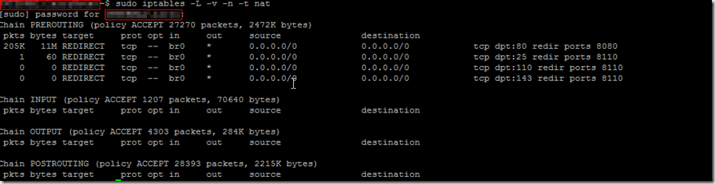

In this guide we will be setting up a mail proxy and spam checker that
will run transparently.  This will be running on our Ubuntu UTM server
that we have been building and you can check out [Part 1](http://everythingshouldbevirtual.com/ubuntu-utm-homebrew "http\://everythingshouldbevirtual.com/ubuntu-utm-homebrew")
and [Part 2](http://everythingshouldbevirtual.com/ubuntu-utm-homebrew-network-graphing "http\://everythingshouldbevirtual.com/ubuntu-utm-homebrew-network-graphing")
as well.

We will be using [EXIM4](http://www.exim.org/) (Using google as a
smarthost), [P3SCAN](http://p3scan.sourceforge.net/),
[SpamAssassin](http://spamassassin.apache.org/) and
[clamav](http://www.clamav.net/) (already installed from part 1 of the
UTM setup).

So let's get started.

Install the packages we need for this all to work

```bash
sudo apt-get install exim4 sa-exim spamassassin
```

Now we need to configure exim to use Google as a smarthost

```bash
sudo dpkg-reconfigure exim4-config
```

Choose "Mail sent by smarthost...
Set system mail name to whatever fits for you
On the screen for "IP address or host name of outgoing smarthost"
enter

```bash
smtp.gmail.com::587
```

(two colons)
Now we need to configure exim with the username/password to use for
relaying to work through google

```bash
sudo nano /etc/exim4/passwd.client
```

add these lines to the end of the file

```bash
smtp.gmail.com:youremail@gmail.com:PaSsWoRd
gmail-smtp.l.google.com:youremail@gmail.com:PaSsWoRd
*.google.com:youremail@gmail.com:PaSsWoRd
```

Now we need to configure the iptables rules for the redirect to work as
traffic passes through our bridged utm server and flows through p3scan. 
This will be accomplished by adding the following rules.

```bash
sudo iptables -t nat -A PREROUTING -i br0 -p tcp -m tcp --dport 25 -j REDIRECT --to-port 8110
sudo iptables -t nat -A PREROUTING -i br0 -p tcp -m tcp --dport 110 -j REDIRECT --to-port 8110
sudo iptables -t nat -A PREROUTING -i br0 -p tcp -m tcp --dport 143 -j REDIRECT --to-port 8110
```

Now we should have a working mail proxy and spam checker as email flows
start passing through the UTM.  This will only work with smtp (tcp/25),
pop3 (tcp/110) and imap (tcp/143).  This setup will not work with any
web based email.  You can verify that email is getting redirected
through the proxy using the following command.

```bash
sudo iptables -L -v -n -t nat
```



And there you go. If you have any questions please let me know.
