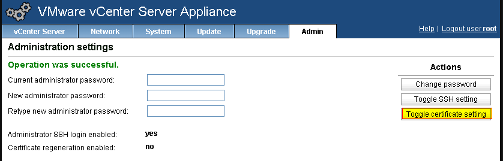
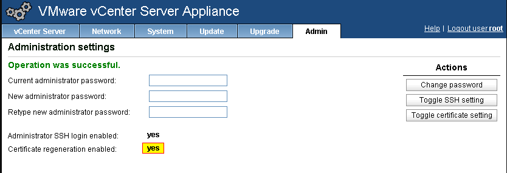

In this guide we will be deploying the VMware vCenter Server Appliance.
You can get this from the downloads at vmware.com. I will also be
deploying this in VMware workstation in this guide, but the recommended
way is to deploy to ESXi. Once it has been deployed I will be
configuring the appliance to use a static address and also join it to
Active Directory, so that we can login using our Active Directory
accounts.

After you have downloaded the appliance you will need to double click
the .ova file to launch the ovftool for Workstation. If you are doing
this using vCenter then you will deploy ova/ovf from the file menu if
using viclient and connect to a host to deploy the appliance on.

Choose where to save the virtual appliance and provide a different name
if you want to.

Now that the appliance has been deployed you can power it on. You may
need to modify the memory if you do not have a lot of memory available
on your system. Also change the network adapter if you need to have the
appliance run on a different network.

After the appliance has booted completely note the IP address
highlighted in the screenshot below for your installation. This is the
IP address you are going to be connecting to with you browswer to
complete the configuration.

Now open the link using your favorite browser and login using
root/vmware (username/password).

Now continue the setup process following the screenshots below.

Select Configure with default settings unless you know exactly what you
are doing here. :)

Click start....

Now the initial setup is completed you will be taken to the summary page
as below.

Now let's configure a static IP address and hostname to the appliance. We will
do that by clicking on the network tab and then Address. Make the necessary
changes as seen below to fit your environment and then save settings. Now reboot
the appliance before making any additional changes.

After the reboot has completed you will need to regenerate SSL certs
from admin tab. You will do this by toggling the cert certificate.
 Note the Certificate regeneration enabled: no (default).

Now you will notice that the Certificate regeneration enabled: yes. Now
you will need to reboot the appliance once more to regenerate SSL certs
and then come back into these settings and toggle certificate setting
back to no so that it does not regenerate SSL certs everytime the
appliance reboots. If you do not regenerate SSL certs after changing
the IP address and/or hostname you will not be able to use the appliance
because the certs will not match.

After the appliance has rebooted we are now ready to start setting up AD
(Active Directory) integration.

First thing is to join the appliance to AD, and you will do this from
the summary page or by clicking the authentication tab.

Check the box for Active Directory Enabled, fill in the information
required and save settings. You will also see on the summary page that
Active Directory is now enabled.

Reboot the appliance for the new settings to take place.

Once the appliance has rebooted again we will be logging into vCenter
using our browser to configure Active Directory logins and assign a role
to a user (Administrator in this setup).

Open your browser of choice and connect to
<https://vcenter:9443/vsphere-client> and login using root/vmware
(username/password).

Once logged in go to Administration and under Sign-On and Discovery
select Configuration and then click the + sign to add a Identity Source.

Now add an Active Directory Source by filling in all details like the
screen below. The secondary server URL in this screenshot is the same
as the Primary and it will complain and not configure it correctly so
either enter a seperate server URL or do not fill it in. I left this
here for demo purposes.

Now click Test Connection.

Click OK if test was successful and now the appliance is configured to
allow us to assign permissions from our Active Directory domain.

Now we will need to grant permissions to a user from our domain. Browse
to vcenter, manage and permissions and click the + sign to add a new
permission.

Select add and select the domain name from the dropdown under the Domain
field. Now browse through the list and select your user/group that you
want to grant permissions to.

Now you need to assign the permission role for this user/group from the
assigned role column. I am granting the Administrator role to the
LAB\\Administrator user account in this scenario.

Hit OK and you will now have added this user to the permissions.

That's it. Now log out of vCenter and login using the account that you
just granted permissions to or a user account that is a member of the
group that you granted permissions for.

And our login is successful. Great Job!

That ends this setup for now and you should now be able to do this for
any additional users/groups that you want to grant access to the vCenter
Virtual Appliance to. Enjoy and leave any comments if you have any
questions or anything. ENJOY!!
