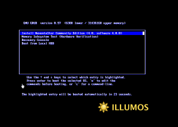
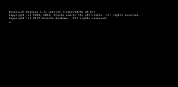
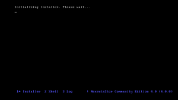
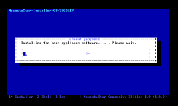
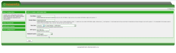

I just downloaded and installed the NexentaStor 4 Beta which is based on
[illumos](http://wiki.illumos.org/ "http\://wiki.illumos.org/"). 
Definitely looking forward to this new release in the near future. Just
a first glance at the NMV it looks the same, but will definitely dig
deeper into this release and provide more feedback.

