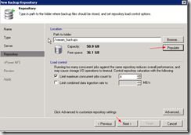

In my testing so far I have decided to throw this together as a valid
scenario which could be a good solution, but obviously open to
additional feedback and testing. And I know I am not the first to do
this so please feel free to provide feedback. And I also look forward to
discussing this with the Veeam engineers.

Thinking through the design of this I am seeing that I would potentially
want to utilize NFS for my backup repositories attached to a linux vm
using 10GB uplinks to my Nexenta NAS (or any other NAS appliance). I
personally like the idea of going this route versus any windows
server(s) having potentially 100+TB of storage hanging off of it even if
it is a Windows 2012 server with all of its newness. And I would never
want to rely on Windows NFS client for anything of this magnitude.
Obviously my goal is to not have to build a physical server and attach
storage to it just for this when I am trying to leverage virtualization.
This is not to say that is a bad idea for anyone, but it doesn't make
sense to me. And to be clear I have equal levels of knowledge on Windows
and Linux just in case you are wondering that.


I am not going through the setup of Veeam in this post, but assuming
that you know how to do the basics and then adding another backup
repository which is on a linux vm. For my testing I enabled root on a
Ubuntu 12.04 vm. Adding a Linux repository requires ssh access to the
server, so make sure the openssh-server package is installed.

enable root with the following command.

```bash
sudo passwd
```

Create the folder on the Nexenta appliance and enable NFS.

Set the settings for the folder as the screenshots below with changes
made with the highlighted settings.


Set the NFS settings on Nexenta as the following screenshot.


Do the following on your Linux vm

Install the NFS client package

```bash
sudo apt-get install nfs-common
```

Create mount point

```bash
sudo mkdir /veeam backups
```

Modify /etc/fstab to add the mount point on boot

```bash
sudo nano /etc/fstab
```

Add the following to the bottom of /etc/fstab and modify to your
environment

```bash
192.168.202.60:/volumes/datapool/veeam_backups /veeam_backups nfs hard,intr,nfsvers=3,tcp,bg,_netdev,auto,nolock 0 0
```

Mount the NFS share

```bash
sudo mount –a
```

Your NFS share should now be mounted

Now you will need to add the Linux server to the backup repository from
the Veeam server console.

Follow the screenshots below to add your new Linux backup repository.





That's it now enjoy your Veeam NFS repository. Feel free to leave
feedback or any questions. I welcome all comments.

