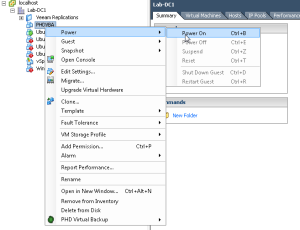
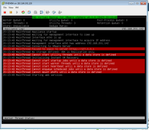
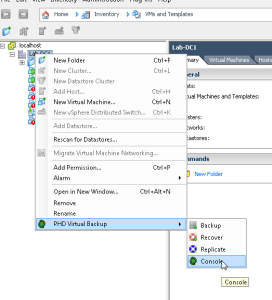
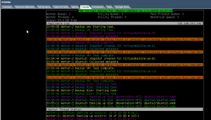

In this post we will be installing PHD Virtual Backup and Replication.
This solution is deployed as a virtual appliance. This means it is a
very quick and easy install. No Windows server required (NO License ! :)
), which is good. Also note  that PHD Virtual is about half the cost of
other solutions of this type. Now don't get excited because there is a
small catch in my opinion. I will post another article showing where the
big difference is when comparing to another solution out there. PHD
Virtual does a very good job at Backups and Replication which is what it
is for correct? :) Anyways the installation is pretty straight forward
so follow along as we get it up and running.

The first thing you will need to do is install the PHD Virtual client on
the Windows computer that you will be running your vCenter client from.
This will add the plugin in order to manage the virtual appliance once
we deploy it.

Now we will deploy the virtual appliance by using the deploy OVF
template from within the vSphere Client (You can also use the new web
UI, but PHD Virtual does not work within the new web UI so why bother.)

Now power on the appliance.

Right click on any object and under PHD Virtual Backup select console.

Click through the screenshots provided below for the configuration setup
from the console. It is very straight forward. I did run into one issue
which I hit them up on over the twitters and they responded right back
and offered assistance, but I have not had the time to get this piece
going yet and that was adding NFS as a storage type. It was timing out.
I am using a Nexenta VSA for this scenario and I had no_root_squash
enabled and root access enabled for the virtual appliance IP address. So
not sure what that was all about. So anyways for testing purposes I
ended up adding a new virtual disk to the virtual appliance to use as
local storage which is shown in the screenshots as well.

Now we are ready to create our first backup job.

Right click on any object and under PHD Virtual Backup select backup.

Follow the screenshots below.

After you have your backup setup and running the screenshot below is
what you will see on the console of the appliance.

That's all there is to it. Now you are ready to start your backups. More
posts will follow going over file level restores, full vm restores and
etc. As well as on replication scenarios.

Feel free to leave comments as I look forward to any and all feedback.

Go [here](https://everythingshouldbevirtual.com/phd-virtual-restores-and-replication "http\://everythingshouldbevirtual.com/phd-virtual-restores-and-replication")
for a look at the restore and replication testing.
