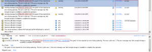

We have run into this issue a few times after migrating servers from
vSphere 4.x to vSphere 5.x. When trying to hot clone a vm the process
fails and generates an error as seen in the screenshot below. We have
seen this on Windows 2008 servers and Windows 7 clients.

Luckily there is a trusty KB article from VMware that helps solve this
issue. The KB article can be found [here](http://kb.vmware.com/selfservice/microsites/search.do?language=en_US&cmd=displayKC&externalId=1028881 "http\://kb.vmware.com/selfservice/microsites/search.do?language=en_US&cmd=displayKC&externalId=1028881").

In short here is all you need to do.

To enable Windows 2008 virtual machine application-consistent quiescing:

1.  Open the VMware vSphere Client, and log into a vCenter Server.
2.  Select **Virtual Machines and Templates** and click the **Virtual
    Machines** tab.
3.  Locate the Windows 2008 virtual machine for which you are enabling
    the disk UUID attribute, and power off the virtual machine.
4.  After power-off, right-click the virtual machine, and choose **Edit
    Settings**.
5.  Click the **Options** tab, and select the **General** entry in the
    settings column (under the **Advanced** entry).
6.  Click **Configuration Parameters**.
7.  Click **Add Row**.
8.  In the **Name** column, enter `disk.EnableUUID`.
9.  In the **Value** column, enter `TRUE`.
10. Click **OK** and click **Save**.
11. Power on the virtual machine.

Enjoy!
