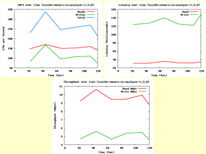
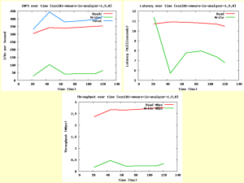

In this post I will be testing Disk IO without SSD for L2ARC and
ZIL/SLOG and then again with SSD for L2ARC and ZIL/SLOG. I will be using
the VMware I/O analyzer from [here](http://labs.vmware.com/flings/io-analyzer).
The SSD drives I will be using are the Intel 520 120GB drives. We will see what
the different IO scenarios will look like for NFS and iSCSI. I will also be changing
the disk sizes for the second virtual disk on the analyzer from the
default of 100MB to 20GB. I am doing this because my NAS/SAN has 16GB of
memory installed and I do not want it to cache the data giving false
output. I will also be running the test duration for the default 120
secs.

Check out
[this ](http://everythingshouldbevirtual.com/nexentastoresxi53750glacpvdsnfsiscsi-part-1/ "http\://everythingshouldbevirtual.com/nexentastoresxi53750glacpvdsnfsiscsi-part-1/")
post and then [this](http://everythingshouldbevirtual.com/nexentastoresxi53750glacpvdsnfsiscsi-part-2-2 "http\://everythingshouldbevirtual.com/nexentastoresxi53750glacpvdsnfsiscsi-part-2-2")
one for information on my Nexenta configurations.

First download the I/O analyzer appliance zip file and then extract it.
Then import the ova file using the vCenter client.

Below are the different VMware IO Analyzer tests used. I tried to use
what I would consider real world scenarios to get a real sense of
performance vs. just seeing max performance. If you would like to see a
test of a different scenario feel free to leave a comment on this post.

**OLTP 4K (4K 70% Read 100% Random) - NFS**

NFS

NFS - SSD

NFS - (Sync=disabled)

 NFS - SSD - (Sync=disabled)

**OLTP 4K (4K 70% Read 100% Random) - iSCSI**

iSCSI

iSCSI - SSD

_Results from above clearly show that iSCSI using SSD for ZIL/SLOG and
L2ARC outperforms the other scenarios including NFS._

**SQL - 64k (64k 66% Read 100% Random) - NFS**

NFS

NFS - SSD

NFS - (Sync=disabled)

NFS - SSD - (Sync=disabled)

**SQL - 64k (64k 66% Read 100% Random) - iSCSI**

iSCSI

iSCSI - SSD

_Results from above clearly show that iSCSI using SSD for ZIL/SLOG and
L2ARC outperforms the other scenarios including NFS._

**Exchange 2007 (8k 55% Read 80% Random) - NFS**

NFS

NFS - SSD

NFS - (Sync=disabled)

NFS - SSD - (Sync=disabled)

**Exchange 2007 (8k 55% Read 80% Random) - iSCSI**

iSCSI

iSCSI - SSD

_Results from above clearly show that iSCSI using SSD for ZIL/SLOG and
L2ARC outperforms the other scenarios including NFS._

**Webserver (**8k 95% Read 75% Random) - NFS\*\*

NFS

NFS - SSD

NFS - (Sync=disabled)

NFS - SSD - (Sync=disabled)

**Webserver (8k 95% Read 75% Random) - iSCSI**

iSCSI

iSCSI - SSD

_Results from above clearly show that iSCSI using SSD for ZIL/SLOG and
L2ARC outperforms the other scenarios including NFS._

**_Notes_**

-   ZIL is not touched using iSCSI unless you disable writeback cache
    for the zvol.
-   For NFS it appears that throughput and IOPS increased marginally,
    but the latency decreased significantly when using SSD for ZIL/SLOG
    and L2ARC. But iSCSI with SSD clearly outperformed NFS in all tests.
-   To check out the usage of L2ARC go
    [here](https://github.com/mharsch/arcstat)and get the arcstat.pl
    script and run it with the following commands.
-   ./arcstat.pl  -f read,hits,miss,hit%,l2read,l2hits,l2miss,l2hit%,arcsz,l2size

That is all I have for this testing scenario and again I welcome
comments and would be glad to perform additional tests if asked.

Enjoy!

\*\*Update\*\* You can see the results of a few of these same tests on
my new server build
[here](http://everythingshouldbevirtual.com/new-nexenta-server-test-iscsi-ssd "http\://everythingshouldbevirtual.com/new-nexenta-server-test-iscsi-ssd").
