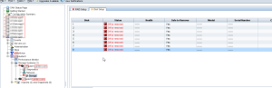

Here is what I have woken up to for today. This is the first time I have
seen this. I rebooted the node to see if it would revive the missing
disks, but no go. Waiting for HP support to help investigate. I will
update this post with the details and what the root cause and solution
is. All I can say is good thing I have a working FOM (Failover Manager)
otherwise the quorum would be offline and I would have a complete
outage.

UPDATE (02-18-2013)

It was a failed cache module and it ended up corrupting the cache on the
Node. Module was replaced and the the cache file had to be deleted. Good
job HP support.

Update (02-19-2013)

Woke up to the same issue again today. Apparently what was fixed did not
resolve the issue.

Update (02-20-2013)

The storage node is now completely dead, just in a continuous reboot.

Update (02-20-2013)

Ended up having the motherboard swapped out and it is now back to normal
for 2 days now.
