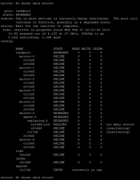

So I just had my first disk failure in over 2 years running this Nexenta
CE server and it is good to see how the hot spare kicked in and I also
replaced the failed drive. Here is a screenshot of the resilvering
process. :)

