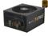
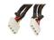

I just ordered all new parts that will be here this week. I will be
replacing my current setup with this. Definitely looking forward to lots
more testing soon. I will be migrating my drives from the current setup
over to this and importing the zpool. Have to love ZFS! :) I will be
installing Nexenta from scratch though.

Below is a parts list of what is coming. Some parts I will be migrating
over from my current Nexenta server.

1 x [CORSAIR TX Series CMPSU-750TX 750W ATX12V v2.3 SLI Ready CrossFire Ready 80 PLUS BRONZE Certified Active PFC Compatible...](http://www.newegg.com/Product/Product.aspx?Item=N82E16817139006 "CORSAIR TX Series CMPSU-750TX 750W ATX12V v2.3 SLI Ready CrossFire Ready 80 PLUS BRONZE Certified Active PFC Compatible with Core i7 Power Supply")

3 x [SUPERMICRO AOC-USAS2-L8i PCI Express SATA / SAS Eight-Port Internal RAID Adapter](http://www.newegg.com/Product/Product.aspx?Item=N82E16816101334 "SUPERMICRO AOC-USAS2-L8i PCI Express SATA / SAS Eight-Port Internal RAID Adapter")

2 x [1ST PC CORP. Model CB-Y8-4 8" Quad 4pin molex splitters - 4pin male molex to 4x 4pin female molex - Sleeved](http://www.newegg.com/Product/Product.aspx?Item=N82E16812706015)

1 x [ASUS P8B WS LGA 1155 Intel C206 ATX Intel Xeon E3 Server/Workstation Motherboard](http://www.newegg.com/Product/Product.aspx?Item=N82E16813131725 "ASUS P8B WS LGA 1155 Intel C206 ATX Intel Xeon E3 Server/Workstation Motherboard")

1 x [NORCO RL-26 Heavy-Duty Slide Rail for rackmount chassis - OEM](http://www.newegg.com/Product/Product.aspx?Item=N82E16811997301 "NORCO RL-26 Heavy-Duty Slide Rail for rackmount chassis - OEM")

 LGA 1155 69W Quad-Core Desktop Processor BX80637i53350P")

1 x [Intel Core i5-3350P Ivy Bridge 3.1GHz (3.3GHz Turbo) LGA 1155 69W Quad-Core Desktop Processor BX80637i53350P](http://www.newegg.com/Product/Product.aspx?Item=N82E16819116782 "Intel Core i5-3350P Ivy Bridge 3.1GHz (3.3GHz Turbo) LGA 1155 69W Quad-Core Desktop Processor BX80637i53350P")

6 x [MASSCOOL FD08025S1M4 80mm Case Cooling Fan](http://www.newegg.com/Product/Product.aspx?Item=N82E16835150007 "MASSCOOL FD08025S1M4 80mm Case Cooling Fan")

 240-Pin DDR3 SDRAM DDR3 1600 (PC3 12800) Desktop Memory Model CML32GX3M4A1600C10B")

1 x [CORSAIR Vengeance LP 32GB (4 x 8GB) 240-Pin DDR3 SDRAM DDR3 1600 (PC3 12800) Desktop Memory Model CML32GX3M4A1600C10B](http://www.newegg.com/Product/Product.aspx?Item=N82E16820233368 "CORSAIR Vengeance LP 32GB (4 x 8GB) 240-Pin DDR3 SDRAM DDR3 1600 (PC3 12800) Desktop Memory Model CML32GX3M4A1600C10B")

 Serial ATA cable")

6 x [3ware CBL-SFF8087-06M 1 unit of 0.6m Multi-lane Internal (SFF-8087) Serial ATA cable](http://www.newegg.com/Product/Product.aspx?Item=N82E16816116094 "3ware CBL-SFF8087-06M 1 unit of 0.6m Multi-lane Internal (SFF-8087) Serial ATA cable")

2 x [Seagate ST90250N1A1AS-RK 250GB 5400 RPM 2.5" SATA 3.0Gb/s Notebook Hard Drive](http://www.newegg.com/Product/Product.aspx?Item=N82E16822148320)

1 x [NORCO RPC-4224 4U Rackmount Server Case with 24 Hot-Swappable SATA/SAS Drive Bays](http://www.newegg.com/Product/Product.aspx?Item=N82E16811219038 "NORCO RPC-4224 4U Rackmount Server Case with 24 Hot-Swappable SATA/SAS Drive Bays")
