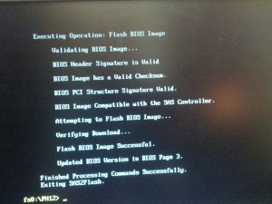
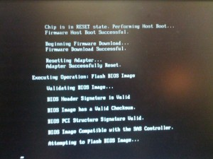
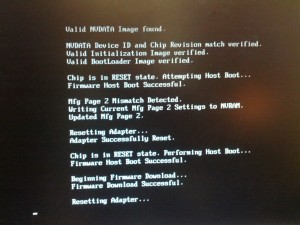
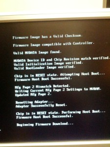
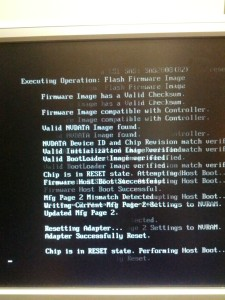
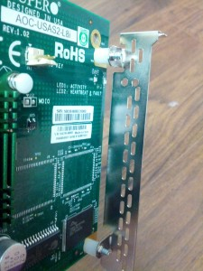
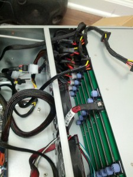
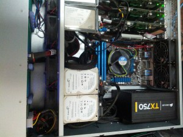
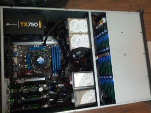

Here are just some random pics of the new NexentaStor server being
built. I will update this post with others as time goes on. Getting
close to the final product this week. Had to make some internal drive
trays for the SSD's and 2.5" Laptop Hard Drives for the mirrored OS
inside the Norco 4224 case.

Flashing firmware of AOC-USAS2-L8i Firmware.

Modified PCI bracket. UIO to PCI.

Modified drive shelves for OS Mirror and SSD's.

