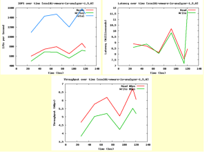

I just did a quick test using the VMware IO Analyzer using the same
tests that I did [here](https://everythingshouldbevirtual.com/nexenta-performance-testing-no-ssdssd "http\://everythingshouldbevirtual.com/nexenta-performance-testing-no-ssdssd").
This test was only using iSCSI with SSD for ZIL/SLOG and L2ARC. But the
results show a considerable jump in performance which means that
apparently the money has been well spent. I also changed the vmdk file
size for the IO Analyzer to 50GB this time seeing as the new server has
32GB of RAM. This way it is not caching the data in memory giving us
false results.

So here are the results of this test.

**OLTP 4K (4K 70% Read 100% Random) -- iSCSI**

Original Test Results

New Test Results

**SQL -- 64k (64k 66% Read 100% Random) -- iSCSI**

Old test results

New test results

**Exchange 2007 (8k 55% Read 80% Random) -- iSCSI**

Old test results

New test results

**Webserver (8k 95% Read 75% Random) -- iSCSI**

Old test results

New test results

As you can see the new server is definitely performing at a much higher
rate than the previous server was. I will be doing some additional
testing here soon to show the comparison even further to my prior build.
So stay tuned for that.

Enjoy!
