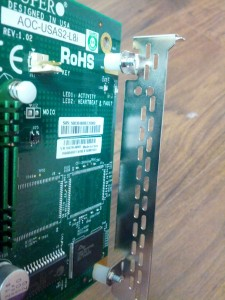
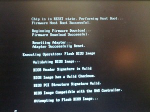

In order to get this SAS controller to work with Nexenta/ZFS you first
need to flash the firmware to enable IT mode. This allows the disks to
be presented as JBOD's which is what we need for ZFS. The following is
what you will need to do in order to accomplish this.

Create bootable USB thumb drive using the steps [here](http://www.sevenforums.com/tutorials/46707-ms-dos-bootable-flash-drive-create.html "http\://www.sevenforums.com/tutorials/46707-ms-dos-bootable-flash-drive-create.html").

Download the firmware from SuperMicro [here](ftp://ftp.supermicro.com/driver/SAS/LSI/2008/IR_IT/Firmware/IT/ "ftp://ftp.supermicro.com/driver/SAS/LSI/2008/IR_IT/Firmware/IT/") and
save it to your USB thumb drive. I like to grab each firmware that is
available at the time of doing this and put them in their respective
folders on the drive. Then I can roll back to an older version in case
of an issue and not have to go download them again. Now you will need to
set the jumper on the card to enable IT mode and then reboot the system
with the SAS controller in it and then run smc2008.bat from within the
folder of the firmware you wish to flash it to.

So in my attempt to flash the controller with my new motherboard
following the process above ended in failure. I received the
message "ERROR: Failed to initialize PAL. Exiting program ". What? :)
So after some google searching I finally found that this is because of
the UEFI BIOS. You can read more on this from [here](http://www.supermicro.com/support/faqs/faq.cfm?faq=12970 "http\://www.supermicro.com/support/faqs/faq.cfm?faq=12970").
The other option is to put this card in another computer that does not
have the UEFI BIOS and follow the process above. I of course will
attempt to flash the card using the EFI boot solution.

For EFI boot. Get an EFI boot loader from [here](http://www.msi.com/service/download/nbdriver-19781.html "http\://www.msi.com/service/download/nbdriver-19781.html").
Extract this on your USB thumb drive.

Another thing you will want to do is get spacers if you have not already
done so to get this card to mount into a standard PCIe slot as these
cards are UIO form.

Here is what you need to get from Home Depot or other store.

-   \#4-40 x 3/8″ machine screws
-   1/4″ inch long nylon spacer (1/4″ x .140″)

Here is a pic of the spacers. I actually flipped them around after
taking this pic. :)

