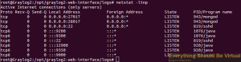
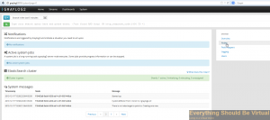
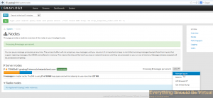
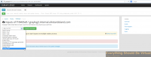
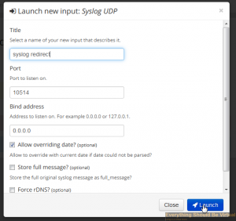
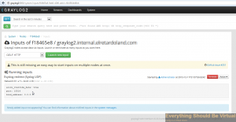
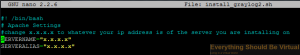
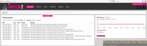
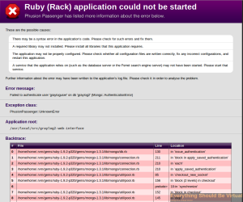

I recently wanted to check out [Graylog2 ](http://graylog2.org/home "http\://graylog2.org/home")
for gathering syslog messages because I have heard good things about it.
Well the issue was that I was not able to find any good articles on how
to accomplish this. I did find some installation scripts that looked
promising, but they would not work correctly for whatever reason. So I
took pieces of some scripts and other sources to compile what should be
a completely accurate setup for now. I will be updating this post as
time goes on. For the most part you can copy the text below and use it
as a shell script. I created and tested this script using a fresh
install of Ubuntu 12.04 x64. There is also a working Debian 6.0 install
script that is available from github which is method 1 below. Method 1
is the preferred method as it will always be the most current. Using
this setup will configure rsyslog to listen on udp/514 and reformat
correctly and then pass on to Graylog2 listening on udp/10514. This
works great for ESXi 5 and other Linux rsyslog clients. For Windows read
the bottom of this post for Windows Event Logging. Let's go. Choose one
of the methods below.

> UPDATE: This script will be maintained in GitHub Repository for
> future releases. <https://github.com/mrlesmithjr/graylog2>
>
> UPDATE: Ubuntu 12.10 support added to github. Method 1 below will
> work for Ubuntu 12.04/12.10/13.04/14.04.\*\*
>
> UPDATE: 07/10/2013. I have added the latest version 0.12.0 of
> graylog2 to the script on github. Please let me know if you run into
> issues. For Ubuntu only now that is.\*\*
>
> UPDATE: 10/12/2013. The issue around installing Ruby on Ubuntu
> 12.04 has now been resolved. The ubuntu script from GitHub below has the
> updates included.\*\*
>
> UPDATE: 10/18/2013. Sudo has been removed from within the script
> so now you can execute the script using sudo and never be prompted again
> during the install.\*\*
>
> UPDATE: 12/11/2013\*\* Preview script added to github\_\*\*
>
> UPDATE: 01/16/2014\*\* Preview script updated to include
> 0.20.0-rc.1\_\*\*
>
> UPDATE: 02/20/2014\*\* The release of 0.20.0 is now available. The
> preferred script to use is further down under v0.20.0 Release.\
> \*\*
>
> UPDATE: 02/24/2014\*\* Updated to v0.20.1\*\*
>
> UPDATE: 06/01/2014\*\* Updated to v0.20.2\*\*
>
> UPDATE: 06/18/2014 \*\* Updated to v0.20.3\*\*
>
> UPDATE: 04/27/2014\*\* Ubuntu 14.04 VMware Virtual Appliance
> Available [here](https://everythingshouldbevirtual.com/ubuntu-14-04-graylog2-virtual-appliance "Ubuntu 14.04 Graylog2 Virtual Appliance").\*\*
>
> UPDATE: 04/29/2014\*\* CentOS install script now available for
> v0.20.1\*\*

\*\*\*~~The following is not for the Preview/RC version or v0.20.1 but for
deprecated v0.12.0 (Not recommended any longer as it is no longer
maintained but available for archival reasons)~~\\

~~Open a terminal~~

```bash
sudo apt-get -y install git
cd ~
git clone <https://github.com/mrlesmithjr/graylog2/>
chmod +x ./graylog2/install_graylog2_ubuntu.sh
```

~~To change your ip address of the server you are installing on you will
need to edit the script or let the script auto detect your IP for
you. The default is auto detect. If you use the default of auto detect
skip editing the file and continue on. Edit the file~~

```bash
nano ./graylog2/install_graylog2_ubuntu.sh
```

    

~~Save the file with ctrl^x. Now enter the following to start running
the script.~~**\
**

```bash
cd ~
sudo ./graylog2/install_graylog2_ubuntu.sh
```

~~The following is for the Preview and rc.1 version ONLY (Use method
above if you want to use the stable current version) - _As of 02/02/2014
the above is outdated so use the method 1 below._~~

**Method 1 \*\*Preferred\*\* All updates will be in Github**

\*\*\*The following is for v0.20.x Releases\\

_Ubuntu Install:_

```bash
sudo apt-get -y install git
cd ~
git clone https://github.com/mrlesmithjr/graylog2/
chmod +x ./graylog2/install_graylog2_20_ubuntu.sh
sudo ./graylog2/install_graylog2_20_ubuntu.sh
```

_CentOS Install:_

```bash
sudo yum install git
cd ~
git clone https://github.com/mrlesmithjr/graylog2/
chmod +x ./graylog2/install_graylog2_20_centos.sh
sudo ./graylog2/install_graylog2_20_centos.sh
```

If you are running v0.20.1+ on Ubuntu and used the auto install script
method from above you can upgrade to the latest Graylog2 versions by
doing the following.

```bash
cd ~
cd graylog2
git pull https://github.com/mrlesmithjr/graylog2
chmod +x Upgrade_Scripts/upgrade_to_latest_graylog2_20_ubuntu.sh
cd ~
sudo ./graylog2/Upgrade_Scripts/upgrade_to_latest_graylog2_20_ubuntu.sh
```

After this completes you should be up and running with the latest
Graylog2 version.

**Graylog2 Virtual Appliance**

Graylog2 virtual appliance available running on Ubuntu 14.04LTS. Head
over [here](https://everythingshouldbevirtual.com/ubuntu-14-04-graylog2-virtual-appliance "Ubuntu 14.04 Graylog2 Virtual Appliance") and get your prebuilt virtual appliance.

**Troubleshooting issues**

If you start getting scrolling java type errors after installing one or
more critical services are not running. You can either reboot or try the
following.

```bash
sudo service graylog2-web-interface stop
sudo service mongodb status
sudo service elasticsearch status
sudo service graylog2 status
```

If any of the above do not return as running and a PID then you will
need to start the service not running by running the following.

```bash
sudo service servicename start
```

You can also run the following and the ports should show the services
running. (Reference screenshot below command window)

```bash
sudo netstat -ltnp
```



**Logging into the new WebUI after installation.**

Open your browser of choice and connect to <http://ip.or.nameofgraylog2server:9000>

Login with username **_admin_** and password is **_password123 (Or password chosen during install script)_**


Click on system


Click on nodes



Select action and then manage inputs



Select Syslog UDP from dropdown



Give it a name of **_syslog redirect_** and port 10514 and then click
launch and close. (Rsyslog is listening on UDP/514 and forwarding to
Graylog2 which is listening on UDP/10514)



You should now see your new input created and accepting traffic.



**\*\*\*\*\*\* If you would like to uninstall the Preview/RC/Release
version I have created an uninstall script to do this. Please use at
your own risk as I am not responsible for anything that may happen by
using this incorrectly. \*\*\*\*\*\***

To uninstall do the following..

```bash
cd ~
mv graylog2 graylog2.old
git clone https://github.com/mrlesmithjr/graylog2
chmod +x ./graylog2/uninstall_graylog2_preview_ubuntu.sh
sudo ./graylog2/uninstall_graylog2_preview_ubuntu.sh
```

Now you can go back and start over if you would like to.

**Want to upgrade from Preview/RC v0.20.0 versions to Final v0.20.0
release? I have a script for that now too. It should preserve all
previous syslog messages but I highly recommend taking a snapshot if you
are using a VM (Hopefully you are! :) ). \*\*NOT FOR v0.12.0 to v0.20.x
releases!!!\*\*\*\
**

The following will take care of the upgrade for you.

```bash
cd ~
mv graylog2 graylog2.old
git clone https://github.com/mrlesmithjr/graylog2/
chmod +x ./graylog2/upgrade_to_graylog2_20_ubuntu.sh
sudo ./graylog2/upgrade_to_graylog2_20_ubuntu.sh
```

 **Debian Installer**

Within the github repository there is also a script to automate a Debian
6.0 Graylog2 installation. If you are installing on Debian 6.0 run the
following instead.

```bash
chmod +x ./graylog2/install_graylog2_debian.sh
cd ~
sudo ./graylog2/install_graylog2_debian.sh
```

**Method 2  **\*\*Note this may be outdated\*\*\*\*\*\*

You can download the script, upload and then extract it to your Ubuntu server
from the link below. [install_graylog2.tar.gz](https://everythingshouldbevirtual.com/wp-content/uploads/2013/03/install_graylog2.tar.gz) If you downloaded the file you will now need to run the following in the
console.

```bash
tar zxvf install_graylog2.tar.gz
chmod +x install_graylog2.sh
nano install_graylog2.sh
```

Change x.x.x.x to whatever your ip address is of the server you are installing
on or let the script auto detect your IP for you. The default is auto detect.


Save the file with ctrl^x. Now run the following to start running the
script. You will be prompted for your sudo password once the script
starts.

```bash
./install_graylog2.sh
```

**Method 3  **\*\*Note this may be outdated\*\*\*\*\*\*

Or you can use the following method from a terminal session on your
Ubuntu server. \*\*Change Servername and ServerAlias to the IP Address
of your server in install_graylog2.sh using nano as below.

```bash
cd ~
wget --user-agent "Mozilla/5.0 (X11; Ubuntu; Linux x86_64; rv:11.0) Gecko/20100101 Firefox/11.0" https://everythingshouldbevirtual.com/wp-content/uploads/2013/03/install_graylog2.tar.gz
tar zxvf install_graylog2.tar.gz
chmod +x install_graylog2.sh
nano install_graylog2.sh
```

Change x.x.x.x to whatever your ip address is of the server you are
installing on or let the script auto detect your IP for you. The default
is to auto detect.



**Method 4  **\*\*Note this may be outdated\*\*\*\*\*\*

Or you can create your own install script as below.

```raw
cd ~
#! /bin/bash
#Provided by @mrlesmithjr
#EveryThingShouldBeVirtual.com
#
#
# Ubuntu Install Script
#
# Setup logging
# Logs stderr and stdout to separate files.
exec 2> >(tee "./graylog2/install_graylog2.err")
exec > >(tee "./graylog2/install_graylog2.log")
#
# Checking if running as root (10/16/2013 - No longer an issue - Should be ran as root or with sudo)
# Do not run as root
# if [[ $EUID -eq 0 ]];then
# echo "$(tput setaf 1)DO NOT RUN AS ROOT or use SUDO"
# echo "Now exiting...Hit Return"
# echo "$(tput setaf 3)Run script as normal non-root user and without sudo$(tput sgr0)"
# exit 1
# fi

# Apache Settings
# change x.x.x.x to whatever your ip address is of the server you are installing on or let the script auto detect your IP
# which is the default
# SERVERNAME="x.x.x.x"
# SERVERALIAS="x.x.x.x"
#
#
echo "Detecting IP Address"
IPADDY="$(ifconfig | grep -A 1 'eth0' | tail -1 | cut -d ':' -f 2 | cut -d ' ' -f 1)"
echo "Detected IP Address is $IPADDY"

SERVERNAME=$IPADDY
SERVERALIAS=$IPADDY

# Disable CD Sources in /etc/apt/sources.list
echo "Disabling CD Sources and Updating Apt Packages and Installing Pre-Reqs"
sed -i -e 's|deb cdrom:|# deb cdrom:|' /etc/apt/sources.list
apt-get -qq update

# Install Pre-Reqs
apt-get -y install git curl apache2 libcurl4-openssl-dev apache2-prefork-dev libapr1-dev libcurl4-openssl-dev apache2-prefork-dev libapr1-dev build-essential openssl libreadline6 libreadline6-dev curl git-core zlib1g zlib1g-dev libssl-dev libyaml-dev libsqlite3-dev sqlite3 libxml2-dev libxslt-dev autoconf libc6-dev ncurses-dev automake libtool bison subversion pkg-config python-software-properties software-properties-common

# Install Oracle Java 7
echo "Installing Oracle Java 7"
add-apt-repository -y ppa:webupd8team/java
apt-get -qq update
echo oracle-java7-installer shared/accepted-oracle-license-v1-1 select true | /usr/bin/debconf-set-selections
apt-get -y install oracle-java7-installer

echo "Downloading Elasticsearch"
chown -R $USER:$USER /opt
cd /opt
git clone https://github.com/elasticsearch/elasticsearch-servicewrapper.git

# Download Elasticsearch, Graylog2-Server and Graylog2-Web-Interface
echo "Downloading Elastic Search, Graylog2-Server and Graylog2-Web-Interface to /opt"
wget https://download.elasticsearch.org/elasticsearch/elasticsearch/elasticsearch-0.20.6.tar.gz
wget https://github.com/Graylog2/graylog2-server/releases/download/0.12.0/graylog2-server-0.12.0.tar.gz
wget https://github.com/Graylog2/graylog2-web-interface/releases/download/0.12.0/graylog2-web-interface-0.12.0.tar.gz

# Extract files
echo "Extracting Elasticsearch, Graylog2-Server and Graylog2-Web-Interface to /opt"
for f in *.tar.gz
do
tar zxf "$f"
done

# Create Symbolic Links
echo "Creating SymLinks for elasticsearch and graylog2-server"
ln -s elasticsearch-0.20.6/ elasticsearch
ln -s graylog2-server-0.12.0/ graylog2-server

# Install elasticsearch
echo "Installing elasticsearch"
mv *servicewrapper*/service elasticsearch/bin/
rm -Rf *servicewrapper*
/opt/elasticsearch/bin/service/elasticsearch install
ln -s `readlink -f elasticsearch/bin/service/elasticsearch` /usr/bin/elasticsearch_ctl
sed -i -e 's|# cluster.name: elasticsearch|cluster.name: graylog2|' /opt/elasticsearch/config/elasticsearch.yml
/etc/init.d/elasticsearch start

# Test elasticsearch
# curl -XGET 'http://localhost:9200/_cluster/health?pretty=true'

# Install mongodb
echo "Installing MongoDB"
apt-key adv --keyserver hkp://keyserver.ubuntu.com:80 --recv 7F0CEB10
echo "deb http://downloads-distro.mongodb.org/repo/ubuntu-upstart dist 10gen" | tee /etc/apt/sources.list.d/10gen.list
apt-get -qq update
apt-get -y install mongodb-10gen

# Install graylog2-server
echo "Installing graylog2-server"
cd graylog2-server-0.12.0/
cp /opt/graylog2-server/elasticsearch.yml{.example,}
ln -s /opt/graylog2-server/elasticsearch.yml /etc/graylog2-elasticsearch.yml
cp /opt/graylog2-server/graylog2.conf{.example,}
ln -s /opt/graylog2-server/graylog2.conf /etc/graylog2.conf
sed -i -e 's|mongodb_useauth = true|mongodb_useauth = false|' /opt/graylog2-server/graylog2.conf

# Create graylog2-server startup script
echo "Creating /etc/init.d/graylog2-server startup script"
(
cat <<'EOF' #!/bin/sh # # graylog2-server: graylog2 message collector # # chkconfig: - 98 02 # description: This daemon listens for syslog and GELF messages and stores them in mongodb # CMD=$1 NOHUP=`which nohup` JAVA_CMD=/usr/bin/java GRAYLOG2_SERVER_HOME=/opt/graylog2-server start() {  echo "Starting graylog2-server ..." $NOHUP $JAVA_CMD -jar $GRAYLOG2_SERVER_HOME/graylog2-server.jar > /var/log/graylog2.log 2>&1 &
}

stop() {
PID=`cat /tmp/graylog2.pid`
echo "Stopping graylog2-server ($PID) ..."
kill $PID
}

restart() {
echo "Restarting graylog2-server ..."
stop
start
}

case "$CMD" in
start)
start
;;
stop)
stop
;;
restart)
restart
;;
*)
echo "Usage $0 {start|stop|restart}"
RETVAL=1
esac
EOF
) | tee /etc/init.d/graylog2-server

# Make graylog2-server executable
chmod +x /etc/init.d/graylog2-server

# Start graylog2-server on bootup
echo "Making graylog2-server startup on boot"
update-rc.d graylog2-server defaults

# Install graylog2 web interface
echo "Installing graylog2-web-interface"
cd /opt/
ln -s graylog2-web-interface-0.12.0 graylog2-web-interface

# Install Ruby
echo "Installing Ruby"
apt-get -y install libgdbm-dev libffi-dev ruby1.9.3

# Install Ruby Gems
echo "Installing Ruby Gems"
cd /opt/graylog2-web-interface
gem install bundler --no-ri --no-rdoc
bundle install

# Set MongoDB Settings
echo "Configuring MongoDB"
echo "
production:
 host: localhost
 port: 27017
 username: grayloguser
 password: password123
 database: graylog2" | tee /opt/graylog2-web-interface/config/mongoid.yml

# Create MongoDB Users and Set Passwords
echo Creating MongoDB Users and Passwords
mongo admin --eval "db.addUser('admin', 'password123')"
mongo admin --eval "db.auth('admin', 'password123')"
mongo graylog2 --eval "db.addUser('grayloguser', 'password123')"
mongo graylog2 --eval "db.auth('grayloguser', 'password123')"

# Test Install
# cd /opt/graylog2-web-interface
# RAILS_ENV=production script/rails server

# Install Apache-passenger
echo Installing Apache-Passenger Modules
gem install passenger
/var/lib/gems/1.9.1/gems/passenger-4.0.20/bin/passenger-install-apache2-module --auto

# Add passenger modules for Apache2
echo "Adding Apache Passenger modules to /etc/apache2/httpd.conf"
echo "LoadModule passenger_module /var/lib/gems/1.9.1/gems/passenger-4.0.20/buildout/apache2/mod_passenger.so" | tee -a /etc/apache2/mods-available/passenger.load
echo "PassengerRoot /var/lib/gems/1.9.1/gems/passenger-4.0.20" | tee -a /etc/apache2/mods-available/passenger.conf
echo "PassengerRuby /usr/bin/ruby1.9.1" | tee -a /etc/apache2/mods-available/passenger.conf

# Enable passenger modules
a2enmod passenger

# Restart Apache2
echo "Restarting Apache2"
service apache2 restart
# If apache fails and complains about unable to load mod_passenger.so check and verify that your passengerroot version matches

# Configure Apache virtualhost
echo "Configuring Apache VirtualHost"
echo "
ServerName ${SERVERNAME}
ServerAlias ${SERVERALIAS}
DocumentRoot /opt/graylog2-web-interface/public

#Allow from all
Options -MultiViews

ErrorLog /var/log/apache2/error.log
LogLevel warn
CustomLog /var/log/apache2/access.log combined" | tee /etc/apache2/sites-available/graylog2

# Enable virtualhost
echo "Enabling Apache VirtualHost Settings"
a2dissite 000-default
a2ensite graylog2
service apache2 reload

# Restart apache
echo "Restarting Apache2"
service apache2 restart

# Now we need to modify some things to get rsyslog to forward to graylog. this is useful for ESXi syslog format to be correct.
echo "Updating graylog2.conf, rsyslog.conf"
sed -i -e 's|syslog_listen_port = 514|syslog_listen_port = 10514|' /etc/graylog2.conf
sed -i -e 's|mongodb_password = 123|mongodb_password = password123|' /etc/graylog2.conf
sed -i -e 's|#$ModLoad immark|$ModLoad immark|' /etc/rsyslog.conf
sed -i -e 's|#$ModLoad imudp|$ModLoad imudp|' /etc/rsyslog.conf
sed -i -e 's|#$UDPServerRun 514|$UDPServerRun 514|' /etc/rsyslog.conf
sed -i -e 's|#$ModLoad imtcp|$ModLoad imtcp|' /etc/rsyslog.conf
sed -i -e 's|#$InputTCPServerRun 514|$InputTCPServerRun 514|' /etc/rsyslog.conf
sed -i -e 's|*.*;auth,authpriv.none|#*.*;auth,authpriv.none|' /etc/rsyslog.d/50-default.conf
# echo '$template GRAYLOG2,"<%PRI%>1 %timegenerated:::date-rfc3339% %HOSTNAME% %syslogtag% - %APP-NAME%: %msg:::drop-last-lf%\n"' | tee /etc/rsyslog.d/32-graylog2.conf
echo '$template GRAYLOG2,"<%PRI%>1 %timegenerated:::date-rfc3339% %FROMHOST% %syslogtag% - %APP-NAME%: %msg:::drop-last-lf%\n"' | tee /etc/rsyslog.d/32-graylog2.conf
echo '$ActionForwardDefaultTemplate GRAYLOG2' | tee -a  /etc/rsyslog.d/32-graylog2.conf
echo '$PreserveFQDN on' | tee -a  /etc/rsyslog.d/32-graylog2.conf
#echo '*.err;*.crit;*.alert;*.emerg;cron.*;auth,authpriv.* @localhost:10514' | tee -a  /etc/rsyslog.d/32-graylog2.conf
# Log syslog levels info and above
echo '*.info @localhost:10514' | tee -a  /etc/rsyslog.d/32-graylog2.conf

#Fixing issue with secret_token in /opt/graylog2-web-interface/config/initializers/secret_token.rb
sed -i -e "s|Graylog2WebInterface::Application.config.secret_token = 'CHANGE ME'|Graylog2WebInterface::Application.config.secret_token = 'b356d1af93673e37d6e21399d033d77c15354849fdde6d83fa0dca19608aa71f2fcd9d1f2784fb95e9400d8eeaf6dd9584d8d35b8f0b5c231369a70aac5e5777'|" /opt/graylog2-web-interface/config/initializers/secret_token.rb

# Restart All Services
echo "Restarting All Services Required for Graylog2 to work"
service elasticsearch restart
service mongodb restart
service graylog2-server restart
service rsyslog restart
service apache2 restart

# All Done
echo "Installation has completed!!"
echo "Browse to IP address of this Graylog2 Server Used for Installation"
echo "IP Address detected from system is $IPADDY"
echo "Browse to http://$IPADDY"
echo "You Entered $SERVERNAME During Install"
echo "Browse to http://$SERVERNAME If Different"
echo "EveryThingShouldBeVirtual.com"
echo "@mrlesmithjr"
```

```bash
chmod +x install_graylog2.sh
./install_graylog2.sh
```

Once the script completes connect to the ip/hostname of your Graylog2
server with your favorite browser and create your first login account.
Or if you have installed on Ubuntu Desktop 12.04 you can just open
firefox and type in <http://localhost>. You will then be prompted to
create your first user.


Once you have created a user account you can then login and you will
have a great looking Graylog2 web ui like below.



If you get a ruby error page like screenshot below when connecting to
the web interface that says unable to authorize grayloguser in mongo
graylog2 db do the following in code box below. On a few occasions the
script is failing to create the mongo db and users. I have only had this
issue when doing an apt-get upgrade prior to running this script.



```bash
mongo admin --eval "db.addUser('admin', 'password123')"
mongo admin --eval "db.auth('admin', 'password123')"
mongo graylog2 --eval "db.addUser('grayloguser', 'password123')"
mongo graylog2 --eval "db.auth('grayloguser', 'password123')"
sudo service elasticsearch restart
sudo service mongodb restart
sudo service graylog2-server restart
sudo service rsyslog restart
sudo service apache2 restart
```

For Windows logging to get sent to Graylog2 check out
[NXLog](http://nxlog.org/ "http\://nxlog.org/"). It supports the GELF
format as well. Below is an example nxlog.conf file for Windows to be
sent to Graylog2 in Gelf format.

```bash
<Extension gelf>
    Module      xm_gelf
</Extension>

<Input in>
    # Use 'im_mseventlog' for Windows XP and 2003
    Module      im_msvistalog
</Input>

<Output out>
    Module      om_udp
    Host        192.168.1.1
    Port        12201
    OutputType  GELF
</Output>

<Route r>
    Path        in => out
</Route>
```

Another thing that I have found is that the graylog2-server by default
listens on IPv6 for UDP/TCP. I was having issues with sending logs to
the udp/10514 port directly. The following code added to
/etc/init.d/graylog2-server will force it to run on IPv4 ports.

```bash
-Djava.net.preferIPv4Stack=true
```

Add the code above to the section under echo "Starting  graylog2-server
..." It should look like the below.

```bash
$NOHUP $JAVA_CMD -Djava.net.preferIPv4Stack=true -jar $GRAYLOG2_SERVER_HOME/graylog2-server.jar > /var/log/graylog2.log 2>&1 &
```

Restart graylog2-server service to take affect.

```bash
sudo /etc/init.d/graylog2-server restart
```

Using Graylog2 (version 0.11.0) I am seeing high CPU usage all the time.
Apparently this is a known thing and will be fixed in a future release
by setting processor_wait_strategy = blocking. The default is
currently processor_wait_strategy = sleeping. Run the following to
make this change.

```bash
sudo sed -i -e 's|processor_wait_strategy = sleeping|processor_wait_strategy = blocking|' /etc/graylog2.conf
sudo /etc/init.d/graylog2-server restart
```

To set the TTL (Time To Live) for Graylog2 messages within Elasticsearch
to keep from filling up all of the disk space. Run the following.

```bash
curl -XPUT 'http://localhost:9200/graylog2/'
curl -XPUT "http://localhost:9200/graylog2/message/_mapping" -d'{"message": {"_ttl" : { "enabled" : true, "default" : "30d" }}}'
```

The first line builds the index and the second line sets the TTL to 30
days.\
To clear all of your messages and hosts from graylog2 do the following.

```bash
cd /opt/elasticsearch/data/graylog2
sudo rm -rf *
mongo
use graylog2
db.message_counts.remove()
db.hosts.remove()
exit
sudo /etc/init.d/elasticsearch restart
```

I just had an issue with my graylog2 server and it was a java process
taking about 90-100 percent CPU even after a reboot. It was caused by
almost all of the disk space used where the mongodb grew too large for
my system. Now you can add more space or just clear the db using the
process above which is what I did. All good now.

Enjoy!
