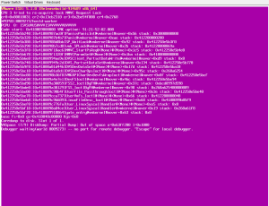
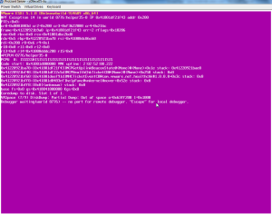

I have recently had several different HP BL490 G6 and G7 servers having
PSOD (purple screen of death) running ESXi 5.1. I was able to capture a
screenshot this time and apparently this issue does not apply to these
models, but I am seeing it for sure. Will be opening a ticket with HP
and VMware. I will be updating this post with what I find out.

04/10/2013 - Installed new firmware on the BL490 G7 which is [here](http://h20000.www2.hp.com/bizsupport/TechSupport/SoftwareDescription.jsp?lang=en&cc=us&prodTypeId=3709945&prodSeriesId=4268682&swItem=MTX-75db597706744a0b8f4ea7fcbb&prodNameId=4268597&swEnvOID=4115&swLang=8&taskId=135&mode=4&idx=3 "http\://h20000.www2.hp.com/bizsupport/TechSupport/SoftwareDescription.jsp?lang=en&cc=us&prodTypeId=3709945&prodSeriesId=4268682&swItem=MTX-75db597706744a0b8f4ea7fcbb&prodNameId=4268597&swEnvOID=4115&swLang=8&taskId=135&mode=4&idx=3").

04/12/2013 - After running the firmware for 2 days now I wanted to see
how things were with the new firmware. I placed one of the BL 490 G7
servers into maintenance mode and then initiated a reboot and here is
what I got again!

Posts that I have found related to this last PSOD.

<http://communities.vmware.com/thread/422723>

<http://kb.vmware.com/selfservice/microsites/search.do?cmd=displayKC&docType=kc&docTypeID=DT_KB_1_1&externalId=2035777>

\*\*Update 04/15/2013\*\*\*

Support case open with VMware now.

Need to create persistent scratch location because all of my hosts in
5.1 boot from USB thumbdrives. Go [here](http://kb.vmware.com/selfservice/microsites/search.do?language=en_US&cmd=displayKC&externalId=1033696 "http\://kb.vmware.com/selfservice/microsites/search.do?language=en_US&cmd=displayKC&externalId=1033696")
on how to do that.

\*\*Update 04/17/2013\*\*

VMware support is currently going through the logs that I sent them to
try and identify the issue. I will update again once I hear back from
them!

\*\*Update 04/21/2013\*\*

VMware support has finished their review of the support logs and they
feel this PSOD is caused by having beacon probing enabled on the
distributed vSwitch configurations. They are aware of this issue and a
fix is coming soon. I will be disabling beacon probing in the next week
and see if the issue is resolved. I have been using beacon probing for
years because of the issue with smartlink on HP virtual connect
(Flex-10).

\*\*Update 05/03/2013\*\*

It looks like the PSOD issue is solved for now. ESXi 5.1U1 fixes the
issue with PSOD with beacon probing enabled for network teaming. I am
currently updating all hosts to the latest and the initial testing seems
to be successful. ESXi 5.1U1 was released on 04/25/2013.
