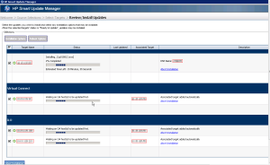

After going through years of changes with the way that firmware is
managed on HP c3000/C7000 blade chassis' I have to say it is absolutely
easy as can be now using the well seasoned HPSUM utility. Below is a
screenshot of it in action.

