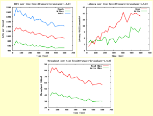
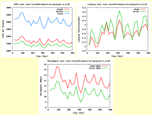

So I have been running my new Nexentastor CE storage for a little more
than a month now and wanted to run another IO test real quick as a
sanity check. So I setup the [VMware IO Analyzer](http://labs.vmware.com/flings/io-analyzer "http\://labs.vmware.com/flings/io-analyzer") again, but changed the virtual disk
size to 150GB and ran the test for 600 secs this time. I ran the same iSCSI
tests as I ran [here](https://everythingshouldbevirtual.com/nexenta-performance-testing-no-ssdssd "http\://everythingshouldbevirtual.com/nexenta-performance-testing-no-ssdssd") to
get an idea of the results I was getting from my older setup. Compare to iSCSI - SSD.

Here are the results.

**OLTP 4K (4K 70% Read 100% Random) -- iSCSI**

**SQL -- 64k (64k 66% Read 100% Random) -- iSCSI**

**Exchange 2007 (8k 55% Read 80% Random) -- iSCSI**

**Webserver (8k 95% Read 75% Random) -- iSCSI**

\*\*Update 05/15/2013\*\*

Updating with NFS results. The same IOMeter tests were done as setup at
the beginning of this post. This time I tested the NFS performance
instead of iSCSI. Again as the test I performed a while back iSCSI
outperformed NFS again.

So here are the results.

**OLTP 4K (4K 70% Read 100% Random) -- NFS**

**SQL -- 64k (64k 66% Read 100% Random) -- NFS**

**Exchange 2007 (8k 55% Read 80% Random) -- NFS**

**Webserver (8k 95% Read 75% Random) -- NFS**

So it looks like I have confirmed that I am definitely getting much
better results on my new build. :) Money well spent!

Enjoy!
