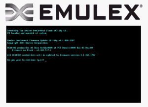
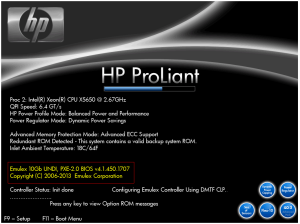

So I was rebuilding some HP BL490G7 blades last week with VMware ESXi
5.1U1 and during the install it stopped with the message that there were
not any network adapters detected therefore the installation would not
continue. These blades had been running ESXi 4.1 for a good year prior
so it caught me a little by surprise. I was also using the HP specific
ISO of ESXi 5.1U1 which includes all of the specific HP drivers. So
after a little digging it turned out to be that all I needed to do was
to update the integrated Emulex firmware on the LOM NICS. Then I was
able to continue on doing the installation as normal.

As you can see in the screenshot I was running firmware version
3.102.517.7 and needed to upgrade to firmware version 4.1.450.1707.

That's it.

Enjoy!
