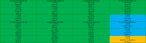
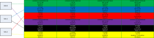
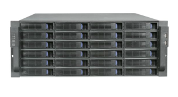

Here is a current view of how my NexentaStor NAS is configured from a
disk and controller perspective. I will be modifying this some here
soon. Go [here](http://everythingshouldbevirtual.com/new-nexenta-server-coming-soon "http\://everythingshouldbevirtual.com/new-nexenta-server-coming-soon") to
take a look at what parts were used to put this all together.

What you see here is that starting on the top left going down and then
again in the next row of disks and so on is what makes up our zdevs
(mirror groups) within each zpool.

There are 3 dual port sas controllers and each row alternates across
controller ports. Which means that each disk that is part of a disk
group is connected to a different controller so if a controller is lost
the zpool does not fail. Each different color represents a controller
path which you can reference the screenshot above to see the disk layout
again.

This is what the front of the actual enclosure looks like to put the
above layouts in perspective.

Enjoy!
