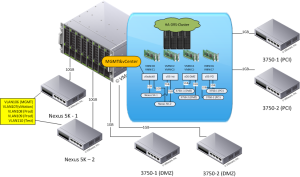
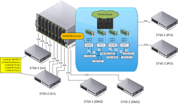
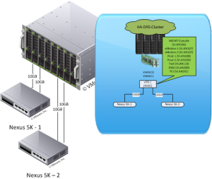

I will be adding some vSphere 5.1 Network Design ideas in this post. I
will be updating it as I create additional scenarios. These designs are
based off of HP C7000 Blade Chassis' using Flex-10 Virtual Connect.

In this first scenario you will see that this is for those that may not
want to put vCenter and Management Consoles into vDS (vSphere
Distributed Switch). This scenario is also for environments that do not
have VLANS for example DMZ or PCI riding on the same uplinks as LAN
VLANS. This design is also using 10GB uplinks as well as 1GB uplinks.

This scenario is the same as above but instead of using 10GB only 1GB
uplinks will be used. You will want to do LACP on the switches bundling
four 1GB uplinks to allow all 1GB uplinks to be active therefore
creating 8GB of total bandwidth.

In this scenario there is only the use of 10GB uplinks connecting to
Nexus 5K to provide access to all of the different networks needed. You
can do LACP on the Nexus 5k to make an active active 20GB uplink to each
switch.

