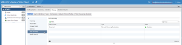
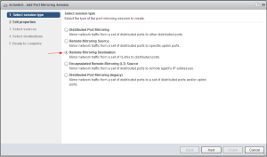
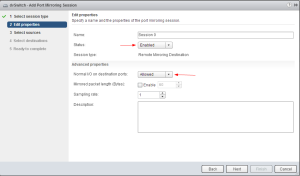
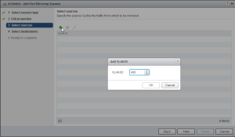
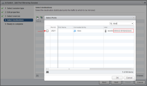
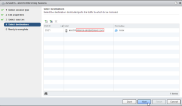
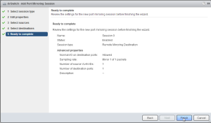
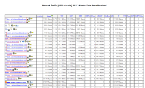
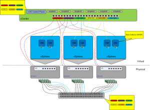

I wanted to throw this together real quick on how to setup RSPAN VLAN
Port Mirroring using a Cisco switch and vDS (vSphere Distributed Switch)
Destination Port Mirror which will map to a vm running
[NTOP](http://www.ntop.org "http\://www.ntop.org"). This solution is
working really well giving all sorts of good information. :) The other
cool thing is that setting up your port mirror this way you will NOT
lose your collected data if the vm migrates to another host via vMotion.
:)

Open an ssh session to your switch and run the following commands to
create the VLAN for your remote span port. And then configure your
monitor sessions for the VLAN(s) you want to capture traffic for.

```bash
conf t
vlan 400
remote-span
exit
monitor session 1 source vlan 1
monitor session 1 source vlan 69
monitor session 1 source vlan 100
monitor session 1 source vlan 107
monitor session 1 source vlan 200-201
monitor session 1 destination remote vlan 400
end

switch01\#

sh monitor

Session 1\
\-\-\-\-\-\-\-\--\
Type : Remote Source Session\
Source VLANs :\
Both : 1,69,100,107,200-201\
Dest RSPAN VLAN : 400
```

Now using the vSphere 5.1 web interface browse to networking, dvswitch
(might be called something else in your environment), manage and
settings.

Click the +New to create your new port mirror session.



Select Remote Mirroring Destination, next ...



Change _status_ to _enabled_ if you want to immediately enable this
monitor session at the end of the wizard or leave disabled and then
enable it later. Change _Normal IO on desination ports_ to _allowed_ if
you want the vm to still communicate on the network for normal traffic.
Next ...



Click the + and enter the VLAN id to capture traffic from. You will need
to make sure that this VLAN is allowed over your uplink trunk ports into
each of your hosts. Ok, Next ...



Click the first + to select the vm port id you want to use to capture
traffic with. Make sure to select the check box. Ok ...



Next ...



Verify all looks good and click Finish.



You have now created the port mirroring session within your distributed
switch to begin capturing data from your switch.

Now you will need to check your vm's UI to view the traffic. If using
NTOP you will connect to <http://hostname:3000>

Here is an example of what you should start seeing.



Here is an example diagram of what your vSphere network deployment might
look like.



That's it. Pretty simple and works really well.

Enjoy!
