In a previous [post](http://everythingshouldbevirtual.com/using-ibm-xiv-and-vsphere5-you-need-to-install-the-vasa-and-management-console-for-vcenter "http\://everythingshouldbevirtual.com/using-ibm-xiv-and-vsphere5-you-need-to-install-the-vasa-and-management-console-for-vcenter") I went through the installation of the IBM XIV VASA version
1.1.1 which was a windows based installation. The VASA provides a lot of good
information from the XIV storage devices.

Taken from the IBM guide [here](http://pic.dhe.ibm.com/infocenter/strhosts/ic/index.jsp?topic=%2Fcom.ibm.help.strghosts.doc%2Fhsg_vasa_1.1.5.html "http\://pic.dhe.ibm.com/infocenter/strhosts/ic/index.jsp?topic=%2Fcom.ibm.help.strghosts.doc%2Fhsg_vasa_1.1.5.html") this is what it provides.

_"The IBM Storage Provider is installed on an IBM Storage Integration
Server (a Linux server) that monitors one or more IBM XIV storage
systems. From that server, the IBM Storage Provider provides a standard
interface for any connected VMware vCenter Server using VMware APIs for
Storage Awareness (VASA), delivering information about storage topology,
capabilities and state, as well as storage events and alerts to vCenter
Server in real time._

_VMware administrators can view this information on the vSphere Client
management station, and can configure storage-related operations
accordingly."_

Version 1.1.5 of the IBM VASA does not install on Windows but rather it
is a RHEL RPM install therefore I will be using a
[CentOS](http://www.centos.org/ "http\://www.centos.org/") 6 vm for this
guide.

Download and install CentOS 6.4 (Latest version at the time of writing
this up). A minimal install will work just fine.

Once CentOS us up and running you will need to do the following from an
SSH session to the server.

```bash
yum install -y libxslt
```

The above will install the failed dependency needed to install all of
the RPM packages.

Download the IBM VASA package from
[here](http://www-933.ibm.com/support/fixcentral/swg/doSelectFixes?options.selectedFixes=IBM_Storage_Provider_for_VMware_VASA_v1.1.5&continue=1 "http\://www-933.ibm.com/support/fixcentral/swg/doSelectFixes?options.selectedFixes=IBM_Storage_Provider_for_VMware_VASA_v1.1.5&continue=1").

Copy the IBM_Storage_Provider_for_VMware_VASA_1.1.5.tar.gz file
over to your CentOS server and extract it.

```bash
tar zxvf IBM_Storage_Provider_for_VMware_VASA_1.1.5.tar.gz
```

Once extracted you will see the following files.

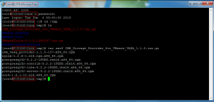

Now you are ready to install the packages. From within the folder where
you extracted the files run the following:

```bash
rpm -ivh *.rpm
```

If you see the following errors running the above command reference the
failed dependency package to install further up in this post.

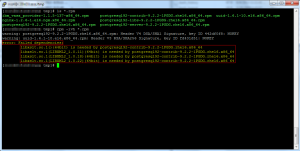

As the packages are installed this is what you should see.

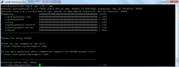

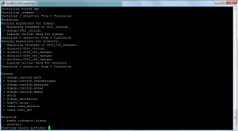

Now that all of the packages are installed you will need to configure
the IPTables firewall to allow inbound communication with TCP/8443. This
can be done as below. The first command will open tcp/8443 inbound and
the second command will save the current firewall rules so they are
saved between reboots. Also the 5 after INPUT  is the rule number to
insert at. With a default install this should be fine as the current
rule #5 should be reject.

```bash
iptables -I INPUT 5 -p tcp --dport 8443 -j ACCEPT
service iptables save
```

Now you will need to switch over to the IBM Storage Provider user mode.
First you will need to set the password for the ibmvp account.

```bash
[root]# passwd ibmvp
Changing password for user ibmvp.
New password: **********
Retype new password: **********
passwd: all authentication tokens updated successfully.
[root]#
```

Now switch over to the ibmvp account.

```bash
[root]# su ibmvp
```

Now you need to add the username and password required to connect to
your XIV storage.

```bash
ibmvp_storage_credentials set -u username -p ***********
```

To list all usernames added for storage credentials.

```bash
ibmvp_storage_credentials list
```

Now you need to create a username and password to access the IBM VASA
server we are setting up. This is the account you will use when adding
the storage provider information into vCenter. Change domain.local to
whatever your domain name is for the email account.

```bash
ibmvp_admin_commands add_user -n vcenteradmin -e vcenteradmin@domain.local -p ********
```

To list all users added.

```bash
ibmvp_admin_commands list_users
```

Now we are ready to add an XIV system. Change the x.x.x.x to whatever
the IP address is of your XIV management interface.

```bash
ibmvp_storage_array add -i x.x.x.x
```

To list all XIV systems added.

```bash
ibmvp_storage_array list
```

To list all volume from the XIV system.

```bash
ibmvp_volume list
```

Now you are ready to register the IBM VASA provider in vCenter.

In the vSphere Client, go to **Administration** > **Storage
Providers**.

Click **Add**.

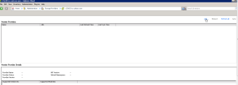

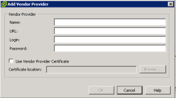

Enter all details needed. Url is servername of VASA server. Login and
password is for the account created above.

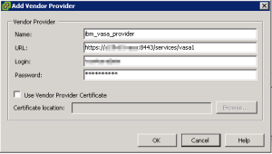

Click "Yes" to the message below.

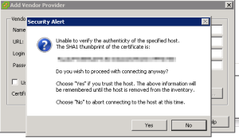

All done.

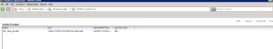

Now we will install the IBM Storage Management for vCenter. This is a
Windows based installation. You can install this on your vCenter Server
and the plugin will be installed. This install is very straightforward
so I will provide the screenshots.

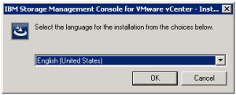

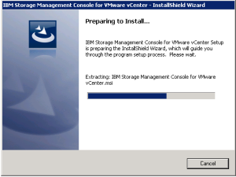

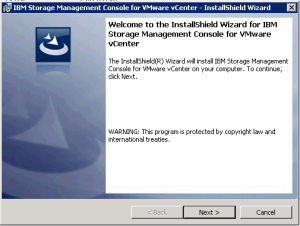

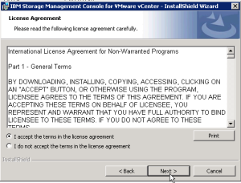

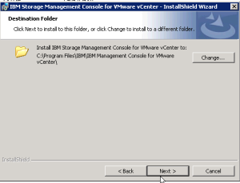

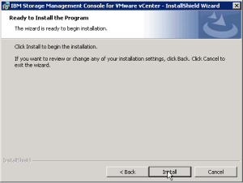

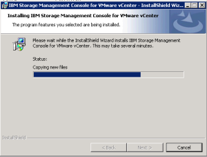

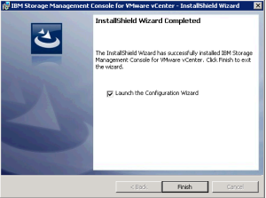

Now you will need to provide the details to add the plugin to vCenter.

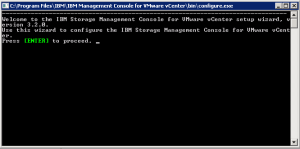

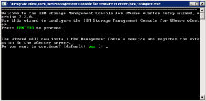

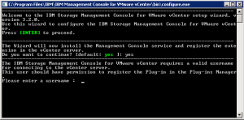

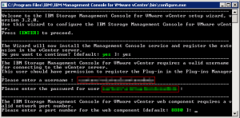

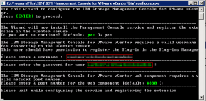

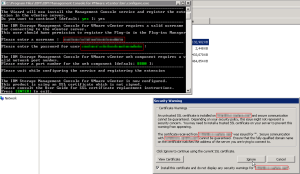

Now click "add" to setup the connection to the storage.

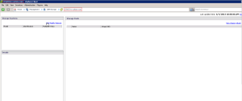

Select the IBM storage type from the drop down.

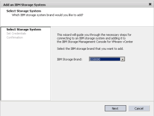

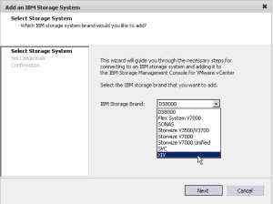

Enter IP/Hostname and provide login credentials.

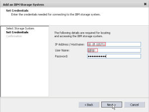

Select the storage pool(s) you want to manage.

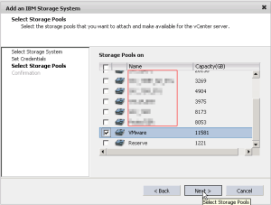

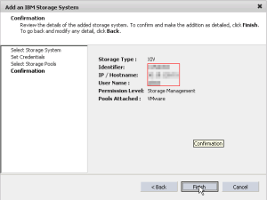

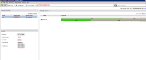

Change the multipathing rules for the storage. This will ensure that
every datastore created or added to vSphere is configure for the correct
SATP rule.

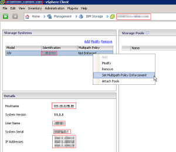

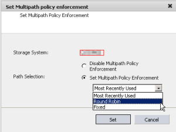

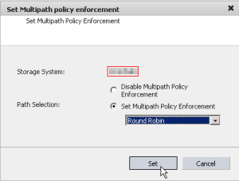

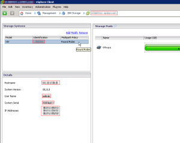

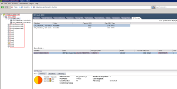

That's it. Now you can enjoy your newly configured utilities for IBM
storage, XIV in my case.

Enjoy!
