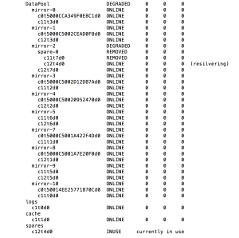

No worries. Global hot spare taking over. This is what I woke up to this
morning. It's all good.

And now the replaced drive is resilvering after the hot-spare took over.

And now everything back to normal. Time to place warranty replacement to
Seagate.

