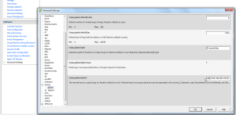
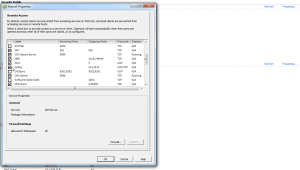

Are you looking for a good syslog collector for your environment but not
wanting to shell out the money for [Splunk](http://www.splunk.com/ "http\://www.splunk.com/")
or [VMware vCenter Log Insight](http://www.vmware.com/products/datacenter-virtualization/vcenter-log-insight/overview.html "http\://www.vmware.com/products/datacenter-virtualization/vcenter-log-insight/overview.html")?
Not saying there is anything wrong with either one of these products
except they can be very expensive and they are overall excellent
products. Especially how tightly integrated VMware vCenter Log Insight
is with other VMware products but if all you really care about is
getting good syslog data which is presented very well and extremely
useful well [Graylog2](http://graylog2.org/ "http\://graylog2.org/") may
be just want you need for your environment. I have been using Graylog2
for a few months now and I absolutely love it. Well of course one reason
is the cost (Open Source) and over the years of using other open source
syslog tools it is an extremely well groomed product and worth looking
into. There is also a great community around this product as well which
are very helpful and responsive.

So my intention of this post is to make those aware of the product that
may not be and to help those who know about the product but may have
issues getting it up and running successfully. I would like to first
direct you to a previous post I did which is all about a shell script
available on
[github](https://github.com/mrlesmithjr/graylog2 "https\://github.com/mrlesmithjr/graylog2")
which will automate the complete installation of Graylog2 on Ubuntu and
Debian. I have been working on this script for a few months now and it
is has been very successful for many including myself. I keep this
script updated with the latest versions as well as tweaking it along the
way as the need arises. Several have requested certain features and
checks to be included so I like to incorporate some of those ideas into
the script when they make sense. So to follow the install instructions
and get an idea of how to get Graylog2 up and running head over to this
[post](http://everythingshouldbevirtual.com/ubuntu-12-04-graylog2-installation "http\://everythingshouldbevirtual.com/ubuntu-12-04-graylog2-installation") and
then return to this post once you have Graylog2 up and running using the
script from Method #1.

Now assuming that you have Graylog2 up and running let's configure our
ESXi hosts to send their syslogs to our new Graylog2 server.

Open your vSphere Client and select your host from vCenter or connect
directly to your host. Select configuration and then advanced settings
under the software section. Scroll down and expand _Syslog_ and select
_global_. Now under _Syslog.global.loghost_ fill in
_udp://ipaddressofgraylog2:514_ then click ok.

Now you have to allow syslog data to be sent from your host. In order to
do this you must configure the firewall on the host to allow this. So on
the configuration page select security profile under the Software
section. Scroll down to syslog and enable the checkbox and click ok.

Once that is done you should start to see syslog data showing up in
Graylog2. The only other thing you might want to do is make sure that
each of your hosts are showing up as unique hosts within Graylog2. Other
than that you are good to go. You can also configure other devices in
your environment to send their syslog data back to your Graylog2 server.

Enjoy!
