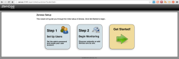
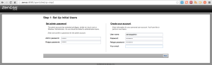
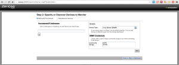
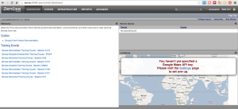

Wanted to throw this together for anyone else who may be looking
everywhere on how to do this as well. I will be adding additional
information as I come across information that might be useful. So this
will be getting updated quite a bit I am sure.

First thing is to build your server to run Zenoss on. I will be using
CentOS for mine.

Install CentOS x64 from DVD and select minimal install.

Once the installation is complete and you have rebooted do the
following.

```bash
yum update
```

Install VMware Tools

```bash
yum -y install http://packages.vmware.com/tools/esx/5.1/repos/vmware-tools-repo-RHEL6-9.0.0-2.x86_64.rpm
yum -y install vmware-tools-esx-nox
```

Uninstall MySQL-Libs otherwise the auto script will fail and tell you to
remove them anyways so go ahead and do it.

```bash
yum -y remove mysql-libs
```

Download Zenoss Auto-Install Script to install Zenoss

```bash
wget --no-check-certificate https://github.com/zenoss/core-autodeploy/tarball/4.2.4 -O auto.tar.gz
tar xvf auto.tar.gz
cd zenoss-core-autodeploy-*
./core-autodeploy.sh
```

During the auto install script it failed to resolve
<http://rpmforge.sw.be/redhat/el6/en/x86_64/rpmforge/RPMS/rpmforge-release-0.5.2-2.el6.rf.x86_64.rpm>
so the script failed and stopped. In order to start again I had to run
the following before running the script again.

```bash
yum -y remove MySQL-*
```

The auto install script will run all the way through and finally prompt
asking if you want to secure the MySQL root account, select (Y/n) and
then the script will continue on. Once the script finishes you will have
a working instance of Zenoss. At this point you c an login to Zenoss
from your browser by going to [http://{ipdaddress\|fqdn}:8080](http://{ipdaddress|fqdn}:8080)
and you will see the following.



Click Get Started



Enter IP address(s) or hostname(s) to start discovering devices manually
or automatically.





That is pretty much it for getting Zenoss up and running. So start
adding some devices and have fun.

When adding Windows devices and would like to use WMI using a domain
account enter the account in the format like _domain\\account_

Monitoring ESXi 5.1 hosts

Install the following packages first.

```bash
yum -y install perl-CPAN make gcc openssl-devel perl-YAML libxml2-devel libuuid-devel glibc.i686 zlib.i686 ncurses-libs.i686 libstdc++.i686 libxml2.i686
```

Download vSphere CLI from
[here](https://my.vmware.com/group/vmware/details?downloadGroup=VSP510-VCLI-51U1&productId=327 "https\://my.vmware.com/group/vmware/details?downloadGroup=VSP510-VCLI-51U1&productId=327")
and transfer to your zenoss server.

You will need to export the following as is if you do not use a proxy
server or add your proxy server ip/hostname and port after the = if you
do. If you don't do this prior to running the install script it will
fail and tell you to enter that information.

```bash
export http_proxy=
export ftp_proxy=
```

Extract the archive after transferring to your Zenoss server.

```bash
tar xzvf VMware-vSphere-CLI-5.1.0-1060453.x86_64.gz
```

Now run the install script.

```raw
cd vmware-vsphere-cli-distrib
./vmware-install.pl
Creating a new vSphere CLI installer database using the tar4 format.

Installing vSphere CLI 5.1.0 build-1060453 for Linux.

You must read and accept the vSphere CLI End User License Agreement to
continue.
Press enter to display it.

VMware(r) Software Development Kit (SDK) License Agreement

......

Do you accept? (yes/no) yes

Thank you.

Please wait while configuring CPAN ...

Please wait while configuring perl modules using CPAN ...

CPAN is downloading and installing pre-requisite Perl module "Archive::Zip" .

CPAN is downloading and installing pre-requisite Perl module
"Class::MethodMaker" .

CPAN is downloading and installing pre-requisite Perl module "UUID" .

CPAN is downloading and installing pre-requisite Perl module "Data::Dump" .

CPAN is downloading and installing pre-requisite Perl module "SOAP::Lite" .

CPAN is downloading and installing pre-requisite Perl module "XML::SAX" .

CPAN is downloading and installing pre-requisite Perl module
"XML::NamespaceSupport" .

CPAN is downloading and installing pre-requisite Perl module
"XML::LibXML::Common" .

CPAN is downloading and installing pre-requisite Perl module "XML::LibXML" .

In which directory do you want to install the executable files?
[/usr/bin]

Please wait while copying vSphere CLI files...

The installation of vSphere CLI 5.1.0 build-1060453 for Linux completed
successfully. You can decide to remove this software from your system at any
time by invoking the following command:
"/usr/bin/vmware-uninstall-vSphere-CLI.pl".

This installer has successfully installed both vSphere CLI and the vSphere SDK
for Perl.

The following Perl modules were found on the system but may be too old to work
with vSphere CLI:

Compress::Zlib 2.037 or newer
Compress::Raw::Zlib 2.037 or newer
IO::Compress::Base 2.037 or newer
IO::Compress::Zlib::Constants 2.037 or newer
LWP::Protocol::https 5.805 or newer

Enjoy,

--the VMware team
```

Enjoy!
