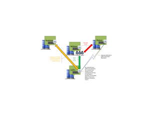

Here is a great scenario for using Veeam Backup and Replication when
relocating a branch office. Say you have a remote office that contains a
rather large file and print server. All office users have been relocated
out of state to another office location but they are still accessing
their shared files across the WAN. To add even more complexity, the
office your users have moved to is also being relocated to another
office building within a few months. The initial thought was to move
those users' data to the interim location by using robocopy to an
existing File and Print server in the interim location. Well as you can
see this can be overly complex and confusing. This is where Veeam could
play a major role. Using Veeam you can create a replication job to
replicate the file and print server at your remote site back to your
datacenter. Depending on how long the replication takes you can then
plan a scheduled cutover to the vm back in your datacenter. This will
allow us to bring up the same instance, name and all, but with of course
a different IP address. Now your users drive mappings will be the same
as they already were and you will not have to make those changes twice
if need be. So once your replication job has synced up and your
scheduled outage has been agreed upon you can then initiate a manual
failover to the instance in your datacenter and then make the change
permanent. So you are wondering, what if it doesn't work? Well just
power off the instance in your datacenter and power the instance back up
at your remote office and you are back to where you started. Sounds too
simple right? Well it is that simple. Now you have the luxury of moving
the data out of your datacenter to the new office location if your needs
are for the data to be local to the site. This is just one great example
of a use case for using Veeam Backup and Replication. Below is a
screenshot of what that scenario might look like on paper.

Enjoy!
