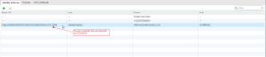

So this past week I have been upgrading my home lab domain from AD 2008
R2 to AD 2012 and so far it has gone without a hitch (read
[here](http://everythingshouldbevirtual.com/server-2012-ad-upgrade-notes "http\://everythingshouldbevirtual.com/server-2012-ad-upgrade-notes")
on this). Well until today that is. I was attempting to login to vCenter
using the viclient and the screenshot below is what I was presented
with.

"A general system error occurred: Authorize Exception". Well that
doesn't look good. :(

So a good Google search returned [this](http://kb.vmware.com/selfservice/microsites/search.do?language=en_US&cmd=displayKC&externalId=1015639 "http\://kb.vmware.com/selfservice/microsites/search.do?language=en_US&cmd=displayKC&externalId=1015639")
KB article about this. Which got me looking at my SSO configuration. So I
logged into my vCenter server and started looking through the event logs
and found this next.

OK so my vcenter domain account(s) added into permissions are not
resolving correctly now. Which got me thinking. I demoted my Windows
2008 R2 domain controller last night could this really be the cause of
my issue? So I tested to make sure that I could launch the viclient fine
using the local administrator account. Success. So I now know that
vCenter is working but domain logins are not working. So I quickly
launched the vCenter web gui and went into my SSO configuration and look
what I found staring at me. I never even thought about this of course.

Sure enough, my active directory identity source was still pointing to
the domain controller that I decommissioned last night. Well we can fix
this easy enough. Remove the old identity source and create a new one
pointing to my two new Server 2012 domain controllers.

Test the connection and success. :)

Now back to the viclient I need to go look at the granted permissions
for my domain user(s).

Sure enough they are all gone.

So let's add them all back.

Ah ha! The accounts are now added back. So now let's check and make
sure that I can log into vCenter again. Success! All done!

So keep this in mind if you are going through a scenario like this.
Especially if you are decommissioning domain controllers. You will need
to make sure beforehand that you add your new domain controller(s) into
SSO as an identity source and remove the old domain controller(s) so you
do not get into a bind here like I did.

Enjoy!
