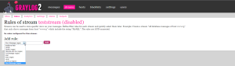
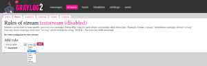
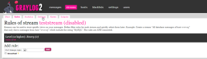
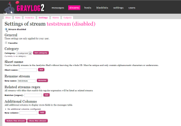
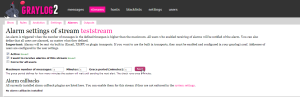
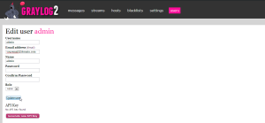

I was recently asked how to get emails working from streams you have
created within the Graylog2 web ui. Seeing as I had done this just
recently I thought I would share what I did to get them working.

So the first thing you need to do is modify /etc/graylog2.conf and find
the section # Email Transport and modify like below. That way you can
get emails to flowing from Graylog2.

```bash
nano /etc/graylog2.conf
# Email transport
transport_email_enabled = true
transport_email_protocol = smtp
transport_email_hostname = yoursmtpserver
transport_email_port = 25
transport_email_use_auth = false
transport_email_use_tls = false
transport_email_auth_username = you@example.com
transport_email_auth_password = secret
transport_email_subject_prefix = [graylog2]
transport_email_from_email = email@yourdomain.com
transport_email_from_name = Graylog2
transport_email_web_interface_url = http://yourgraylogservername.domain.com
```

Now create your streams however you want and set the thresholds.










Make the alarm active and select I want to receive alarms. And set your
messages, minutes and grace period.



Now edit your username and make sure that you have an email address
added for your user that you want to receive emails.



That's it!

Enjoy!
