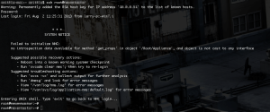

I was just getting ready to swap out a failing drive in my Nexentastor
CE NAS and tried to log into the web interface and received "Waiting to
establish NMS Connection". Well I have obviously seen this before so I
figured I would ssh to it and see what was going on. Well not so
promising at first! :)

After a long delay after entering username/password to login here is
what I was seeing.



OK great! Anyways this is actually quite simple and no reboot is
required. After all this is not Windows! :)

At the command prompt enter the following commands

```bash
svcadm disable -st nms\:default
svcadm enable -rs nms\:default
```

After the second command completes you should be able to get back into
your web interface. Once you can get back into the web interface type
exit on on your console session to get back to the nmc.

All done.

Enjoy!
