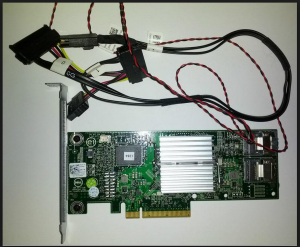

I have been using Nexenta for several years now of course. Over those
years I have been using Supermicro SAS controllers reflashed into IT
mode cards so the sata disks will pass through as individual disks.
After building out my latest Nexenta build I still had all of the parts
from my first build except controller cards. I had been using this
hardware for running Hyper-V but I really did not have any need to keep
doing any testing with Hyper-V. That of course is for another day. So I
had been looking around for some fairly cheap controllers to put in this
box so that I could use it for dedicated Veeam backups. The Supermicro
controllers that I had been using are about $140/each which is not bad
but I wanted to go cheaper if I could. There are a lot of people using
IBM M1015, Dell H200, Supermicro and many others. I found some info
about the Dell H310 controllers but not a whole lot in regards to using
these cards for ZFS specifically with Nexenta. Part of what drove me to
these cards is that they are newer than the Dell H200 and cheaper than
the H200 and IBM M1015 as well. Mainly because it would appear that most
people know about being able to use these cards for ZFS after flashing
them so the prices are still rather high. After all each one of these
cards are just rebranded LSI controllers anyways. I was able to get two
of the H310 controllers off of eBay for $150 including shipping.

So after the cards finally arrived this past week I went ahead and began
the process of reflashing them so I could get them into IT mode cards.
After I thought I had actually bricked my first card :) I was in
business. So the process to get these cards flashed is not too bad but
it did have a few gotchas.

Here is what the H310's look like.



So here is the process to reflash the cards into IT mode.

First thing you will need is a bootable MS-DOS thumb drive. Go [here](http://blogs.technet.com/b/csstwplatform/archive/2012/06/26/how-to-create-a-ms-dos-bootable-usb-flash-drive.aspx "http\://blogs.technet.com/b/csstwplatform/archive/2012/06/26/how-to-create-a-ms-dos-bootable-usb-flash-drive.aspx")
for info on this.

Grab the IT mode firmware from Dell [here](http://www.dell.com/support/drivers/us/en/19/DriverDetails/Product/poweredge-r610?DriverId=6M53D&FileId=2731103519&DriverName=Dell%206Gbps%20SAS%20HBA%2C%20v.07.03.05.00%2C%20A08&urlProductCode=False "http\://www.dell.com/support/drivers/us/en/19/DriverDetails/Product/poweredge-r610?DriverId=6M53D&FileId=2731103519&DriverName=Dell%206Gbps%20SAS%20HBA%2C%20v.07.03.05.00%2C%20A08&urlProductCode=False").

Grab
[this](ftp://ftp.supermicro.com/driver/SAS/LSI/2008/iMR/Firmware/Non_Blade/USB.zip "ftp://ftp.supermicro.com/driver/SAS/LSI/2008/iMR/Firmware/Non_Blade/USB.zip")
zip file which includes the megarec utility.

You can also grab [this](http://www.files.laptopvideo2go.com/hdd/sas2008.zip "http\://www.files.laptopvideo2go.com/hdd/sas2008.zip")
zip file to get the megarec utility along with the sbrempty.bin file.

And now put the files from Dell and the megarec utility on your thumb
drive and boot it up. I had to copy the firmware and BIOS files to the
root of the thumb drive to work for me so keep that in mind.

Run the following to list your controller cards that are installed in
your system.

```bash
megarec -listall
sas2flsh -listall
```

The first command "megarec -writesbr 0 sbrempty.bin" wipes the card
completely so sas2flsh will recognize the card as an LSI controller. But
before you do this like I did. :) Make sure that you get your SAS
Controller Address from the card. This card does not have a sticker like
other cards do but instead you can list the address by running

```bash
sas2flsh -list
```

and write down the SAS address which starts with "500605b". If you
don't write it down you are hosed. :) J/K! I thought I was too but I
was able to magically come up with a random address starting with
"500605b" and writing it to the card. :)

```bash
megarec -writesbr 0 sbrempty.bin
megarec -cleanflash 0
```

Now reboot using the USB boot drive again and let's flash the
controller with the IT mode firmware.

```bash
sas2flsh -o -f 6gbpsas.fw
sas2flsh -o -b mptsas2.rom
sas2flsh -o -sasadd 500605bxxxxxxxxx
```

And that is it. Now reboot and you should see the card initializing
again. All done!

One more thing is that you can crossflash these cards to an actual LSI
non-Dell firmware as well. I have not done that yet but I may do so soon
and will update this post here with any details.

Enjoy!
You can find my other posts about Nexenta by going
[here](https://everythingshouldbevirtual.com/tag/nexenta "http\://everythingshouldbevirtual.com/tag/nexenta").
