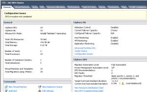

I just came across this for the first time in one of my vSphere 5.1
HA-DRS clusters. One of my clusters had an error saying "DRS invocation
not completed."

I have never seen this before so I first tried to disable DRS and then
re-enable DRS under cluster settings and this did not work. So I then
tried to disconnect each host in the cluster and then reconnect them and
magically the issue went away. So I wanted to share this with others in
case you run into this yourself as well.

Enjoy!
