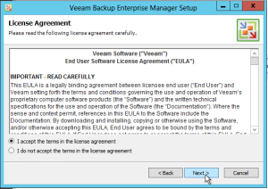
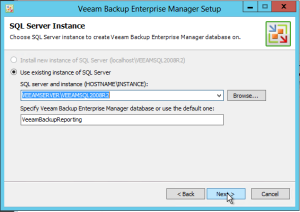
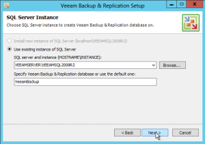

In this article I will be running through a quick Veeam upgrade from 6.5
to 7.0. This is a fairly straight forward and smooth process. So for the
most part I will just be including screenshots of the process. I will be
following up with additional posts on functionality and such.

So let's get started.

Launch the installer.

I am running Backup Enterprise Manager in my environment so this will
need to be upgraded first.

Enterprise Manager has now been upgraded and you will need to reboot
now.

After the reboot has completed launch the installer again.

Now let's upgrade Backup and Replication.

Backup and Replication has now been upgraded and a reboot is required
again. So go ahead and reboot one last time.

After the reboot has completed login and launch Backup and Replication.

Boom! v7 up and running!

Now all Veeam proxies will need to have their agents upgraded.

All done. Now enjoy the new version of Veeam Backup and Replication v7.
