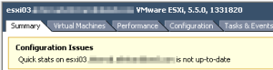

I have seen this error since I upgraded to vSphere 5.5 last week. There
is a kb article
[here](http://kb.vmware.com/selfservice/microsites/search.do?language=en_US&cmd=displayKC&externalId=2061008 "http\://kb.vmware.com/selfservice/microsites/search.do?language=en_US&cmd=displayKC&externalId=2061008")
on how to fix this. According to this kb article this is a known issue in
vCenter 5.5. I am using the vCSA (vCenter Server Appliance) and it is
affected as well. So I just wanted to share what to do based on the KB
article.

Screenshot of the error.



Open putty and ssh to your vCSA and execute the following.

```bash
cd /etc/vmware-vpx/
cp vpxd.cfg vpxd.cfg.orig
vim vpxd.cfg
```

Now scroll down to the line before \</vpxd> and insert the following
code from the kb article referenced above.

```xml
<quickStats\>
  <HostStatsCheck\>false</HostStatsCheck\>
  <ConfigIssues\>false</ConfigIssues\>
</quickStats\>
```

Now restart vCenter Server Service

```bash
service vmware-vpxd restart
```

Now after the services have restarted all should be good.

Enjoy!
